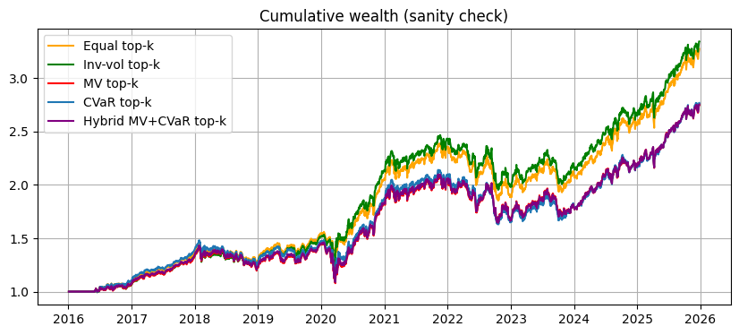

```python
%run 00setup.ipynb
```

    ✅ Setup complete
    


```python
# Signal output from 03LGBMsignal.ipynb (ranker)
oos = load_df("oos_predictions_ranker", DATA_DIR, fmt="parquet")


prices = load_df("prices_clean", DATA_DIR, fmt="parquet")

# Standardize types/order
oos["date"] = pd.to_datetime(oos["date"])
prices["date"] = pd.to_datetime(prices["date"])

oos = oos.sort_values(["date", "ticker"]).reset_index(drop=True)
prices = prices.sort_values(["date", "ticker"]).reset_index(drop=True)

print("oos:", oos.shape, "| prices:", prices.shape)
print("tickers:", oos["ticker"].nunique(), "dates:", oos["date"].nunique())
```

    oos: (50200, 7) | prices: (71373, 8)
    tickers: 20 dates: 2510
    


```python
price_col = "adj_close"
prices["ret_1d"] = prices.groupby("ticker")[price_col].pct_change()

R = prices.pivot(index="date", columns="ticker", values="ret_1d").sort_index()
R = R.replace([np.inf, -np.inf], np.nan).dropna(how="all")
print("R panel:", R.shape, "| from:", R.index.min(), "to:", R.index.max())
```

    R panel: (3568, 20) | from: 2011-10-21 00:00:00 to: 2025-12-30 00:00:00
    


```python
# Cell 3 — Build signal score panel S[t, asset]

score_col = "y_pred"
S = oos.pivot(index="date", columns="ticker", values=score_col).sort_index()

common_dates = R.index.intersection(S.index)
R = R.loc[common_dates]
S = S.loc[common_dates]

print("Aligned:", "R", R.shape, "S", S.shape)
print("Backtest range:", common_dates.min(), "to", common_dates.max())
print("Score column used:", score_col)
```

    Aligned: R (2510, 20) S (2510, 20)
    Backtest range: 2016-01-04 00:00:00 to 2025-12-24 00:00:00
    Score column used: y_pred
    


```python
# Cell 4 — Helpers: 3-regime selection + constrained weight constructors

from scipy.optimize import minimize

EQUITY_TICKERS = [
    "SPY","QQQ","DIA","IWM","VUG","VTV","USMV","FEZ","EWU","EWJ","EEM"
]

DEFENSIVE_TICKERS = [
    "TLT","IEF","SHY","LQD","GLD","DBC","VNQ","XLU","XLP"
]

def pick_regime_topk(scores: pd.Series, regime: str) -> pd.Index:
    scores = scores.dropna()

    eq_scores = scores[scores.index.isin(EQUITY_TICKERS)].dropna()
    def_scores = scores[scores.index.isin(DEFENSIVE_TICKERS)].dropna()

    if regime == "risk_off":
        return def_scores.nlargest(min(4, len(def_scores))).index

    elif regime == "strong_bull":
        return eq_scores.nlargest(min(4, len(eq_scores))).index

    else:  # normal_risk_on
        selected = []
        if len(eq_scores) > 0:
            selected.extend(eq_scores.nlargest(min(3, len(eq_scores))).index.tolist())
        if len(def_scores) > 0:
            selected.extend(def_scores.nlargest(min(1, len(def_scores))).index.tolist())
        return pd.Index(selected).unique()

def w_equal(top: pd.Index) -> pd.Series:
    w = pd.Series(0.0, index=R.columns)
    if len(top) > 0:
        w.loc[top] = 1.0 / len(top)
    return w

def w_inv_vol(ret_hist: pd.DataFrame, top: pd.Index, eps=1e-8) -> pd.Series:
    w = pd.Series(0.0, index=R.columns)
    if len(top) == 0:
        return w
    vol = ret_hist[top].std(ddof=0).replace(0, np.nan)
    inv = 1.0 / (vol + eps)
    inv = inv.replace([np.inf, -np.inf], np.nan).fillna(0.0)
    if inv.sum() > 0:
        w.loc[top] = inv / inv.sum()
    else:
        w.loc[top] = 1.0 / len(top)
    return w

def score_floor_from_selected(scores: pd.Series, top: pd.Index, floor_frac: float = 0.25) -> float:
    s = scores[top].astype(float)
    s_mean = s.mean()
    s_max = s.max()
    return float(s_mean + floor_frac * (s_max - s_mean))

def w_mean_variance(ret_hist: pd.DataFrame,
                    scores: pd.Series,
                    top: pd.Index,
                    floor_frac: float = 0.25,
                    ridge: float = 1e-3,
                    w_max: float = 0.60) -> pd.Series:
    w = pd.Series(0.0, index=R.columns)
    if len(top) == 0:
        return w

    X = ret_hist[top].dropna(how="any")
    if X.shape[0] < 20:
        return w_equal(top)

    Sigma = np.cov(X.values, rowvar=False, ddof=0)
    Sigma = Sigma + ridge * np.eye(Sigma.shape[0])

    mu = scores[top].astype(float).values
    mu_floor = score_floor_from_selected(scores, top, floor_frac=floor_frac)

    n = len(top)
    x0 = np.ones(n) / n

    def objective(ww):
        return float(ww @ Sigma @ ww)

    constraints = [
        {"type": "eq",   "fun": lambda ww: np.sum(ww) - 1.0},
        {"type": "ineq", "fun": lambda ww: float(mu @ ww - mu_floor)},
    ]
    bounds = [(0.0, w_max)] * n

    res = minimize(
        objective,
        x0,
        method="SLSQP",
        bounds=bounds,
        constraints=constraints,
        options={"maxiter": 500, "ftol": 1e-9}
    )

    if not res.success:
        return w_inv_vol(X, top)

    ww = np.clip(res.x, 0.0, w_max)
    s = ww.sum()
    if s <= 0:
        return w_equal(top)

    w.loc[top] = ww / s
    return w

def w_cvar(ret_hist: pd.DataFrame,
           scores: pd.Series,
           top: pd.Index,
           alpha: float = 0.95,
           floor_frac: float = 0.25,
           w_max: float = 0.35) -> pd.Series:
    w = pd.Series(0.0, index=R.columns)
    if len(top) == 0:
        return w

    X = ret_hist[top].dropna(how="any")
    if X.shape[0] < 20:
        return w_equal(top)

    Xv = X.values
    mu = scores[top].astype(float).values
    mu_floor = score_floor_from_selected(scores, top, floor_frac=floor_frac)

    n = len(top)
    z0 = np.zeros(n + 1)
    z0[1:] = 1.0 / n

    def objective(z):
        v = z[0]
        ww = z[1:]
        losses = -Xv @ ww
        tail = np.maximum(losses - v, 0.0)
        return float(v + tail.mean() / (1.0 - alpha))

    constraints = [
        {"type": "eq",   "fun": lambda z: np.sum(z[1:]) - 1.0},
        {"type": "ineq", "fun": lambda z: float(mu @ z[1:] - mu_floor)},
    ]
    bounds = [(None, None)] + [(0.0, w_max)] * n

    res = minimize(
        objective,
        z0,
        method="SLSQP",
        bounds=bounds,
        constraints=constraints,
        options={"maxiter": 500, "ftol": 1e-9}
    )

    if not res.success:
        return w_equal(top)

    ww = np.clip(res.x[1:], 0.0, w_max)
    s = ww.sum()
    if s <= 0:
        return w_equal(top)

    w.loc[top] = ww / s
    return w

def w_hybrid_mv_cvar(ret_hist: pd.DataFrame,
                     scores: pd.Series,
                     top: pd.Index,
                     mv_weight: float = 0.8,
                     alpha: float = 0.95,
                     floor_frac: float = 0.25,
                     ridge: float = 1e-3) -> pd.Series:
    w_mv = w_mean_variance(ret_hist, scores, top, floor_frac=floor_frac, ridge=ridge, w_max=0.60)
    w_c  = w_cvar(ret_hist, scores, top, alpha=alpha, floor_frac=floor_frac, w_max=0.35)
    w = mv_weight * w_mv + (1.0 - mv_weight) * w_c
    s = w.sum()
    if s <= 0:
        return w_equal(top)
    return w / s
```


```python
# Cell 5 — Optimization loop (walk-forward), outputs weights per date
# Regime-specific holding periods:
#   risk_off     -> 3 days
#   normal       -> 5 days
#   strong_bull  -> 10 days
# Re-assess every 3 days, but only refresh weights when the regime-specific holding period has elapsed
# or the selected basket changes enough.

lookback = 63
assessment_every = 3
floor_frac = 0.25
mv_weight = 0.8

# regime-specific holding periods
hold_map = {
    "risk_off": 3,
    "normal_risk_on": 5,
    "strong_bull": 10,
}

# trade buffer: only rebalance if basket overlap is too low
# Example: if old and new top baskets overlap by >= 75%, keep old weights until holding period expires.
min_overlap_keep = 0.75

dates = common_dates.sort_values()
assess_dates = dates[::assessment_every]

# --- Regime indicators from SPY price ---
spy_px = (
    prices.loc[prices["ticker"] == "SPY", ["date", "adj_close"]]
          .assign(date=lambda x: pd.to_datetime(x["date"]))
          .drop_duplicates("date")
          .set_index("date")["adj_close"]
          .reindex(dates)
          .ffill()
)

spy_ma50 = spy_px.rolling(50).mean()
spy_ma100 = spy_px.rolling(100).mean()

def get_regime(d):
    px = spy_px.loc[d]
    ma50 = spy_ma50.loc[d]
    ma100 = spy_ma100.loc[d]

    if pd.isna(ma50) or pd.isna(ma100):
        return "normal_risk_on"

    if px < ma100:
        return "risk_off"
    elif px >= ma50 and px >= ma100:
        return "strong_bull"
    else:
        return "normal_risk_on"

def basket_overlap(a: pd.Index, b: pd.Index) -> float:
    a = pd.Index(a)
    b = pd.Index(b)
    if len(a) == 0 and len(b) == 0:
        return 1.0
    if len(a) == 0 or len(b) == 0:
        return 0.0
    return len(set(a) & set(b)) / max(len(set(a) | set(b)), 1)

W_eq   = []
W_vp   = []
W_mv   = []
W_cvar = []
W_hyb  = []

regime_log = []
decision_log = []

last_rebal_date = None
last_regime = None
last_top = pd.Index([])
last_w_eq = None
last_w_vp = None
last_w_mv = None
last_w_cvar = None
last_w_hyb = None

for d in assess_dates:
    idx = dates.get_loc(d)
    if idx < max(lookback, 100):
        continue

    hist_dates = dates[idx - lookback: idx]
    ret_hist = R.loc[hist_dates]

    scores_today = S.loc[d].dropna()
    scores_today = scores_today[scores_today.index.isin(R.columns)]

    regime = get_regime(d)
    hold_days = hold_map[regime]

    top = pick_regime_topk(scores_today, regime=regime)

    # decide whether to refresh weights
    force_first = last_rebal_date is None
    days_since_rebal = 10**9 if force_first else assess_dates.get_loc(d) - assess_dates.get_loc(last_rebal_date)
    required_steps = max(1, int(np.ceil(hold_days / assessment_every)))
    enough_time_elapsed = force_first or (days_since_rebal >= required_steps)

    overlap = basket_overlap(last_top, top) if not force_first else 0.0
    basket_changed_enough = force_first or (overlap < min_overlap_keep)

    # always allow regime change to trigger rebalance
    regime_changed = force_first or (regime != last_regime)

    do_rebalance = force_first or regime_changed or (enough_time_elapsed and basket_changed_enough)

    if do_rebalance:
        w_eq_new = w_equal(top)
        w_vp_new = w_inv_vol(ret_hist, top)
        w_mv_new = w_mean_variance(
            ret_hist, scores_today, top,
            floor_frac=floor_frac, ridge=1e-3, w_max=0.60
        )
        w_cvar_new = w_cvar(
            ret_hist, scores_today, top,
            alpha=0.95, floor_frac=floor_frac, w_max=0.35
        )
        w_hyb_new = w_hybrid_mv_cvar(
            ret_hist, scores_today, top,
            mv_weight=mv_weight, alpha=0.95,
            floor_frac=floor_frac, ridge=1e-3
        )

        last_w_eq = w_eq_new
        last_w_vp = w_vp_new
        last_w_mv = w_mv_new
        last_w_cvar = w_cvar_new
        last_w_hyb = w_hyb_new

        last_rebal_date = d
        last_regime = regime
        last_top = top

        action = "rebalance"
    else:
        action = "hold"

    W_eq.append((d, last_w_eq))
    W_vp.append((d, last_w_vp))
    W_mv.append((d, last_w_mv))
    W_cvar.append((d, last_w_cvar))
    W_hyb.append((d, last_w_hyb))

    regime_log.append((d, regime))
    decision_log.append((d, regime, hold_days, overlap, action, len(top)))

W_eq   = pd.DataFrame({d: w for d, w in W_eq}).T.sort_index()
W_vp   = pd.DataFrame({d: w for d, w in W_vp}).T.sort_index()
W_mv   = pd.DataFrame({d: w for d, w in W_mv}).T.sort_index()
W_cvar = pd.DataFrame({d: w for d, w in W_cvar}).T.sort_index()
W_hyb  = pd.DataFrame({d: w for d, w in W_hyb}).T.sort_index()

regime_log = pd.DataFrame(regime_log, columns=["date", "regime"]).set_index("date")
decision_log = pd.DataFrame(
    decision_log,
    columns=["date", "regime", "hold_days", "overlap", "action", "basket_size"]
).set_index("date")

print("Weights built:", W_eq.shape, W_vp.shape, W_mv.shape, W_cvar.shape, W_hyb.shape)
print("Backtest range:", common_dates.min(), "to", common_dates.max())
print("Regime rules:")
print("- risk_off: SPY < 100D MA -> 4 defensive assets, hold 3 days")
print("- strong_bull: SPY >= 100D MA and SPY >= 50D MA -> 4 equities, hold 10 days")
print("- normal_risk_on: otherwise -> 3 equities + 1 defensive, hold 5 days")
print("Assessment frequency:", assessment_every, "days")
print("Trade buffer overlap threshold:", min_overlap_keep)
print("Rebalance decisions:")
print(decision_log["action"].value_counts())
print("Regime share:")
print(regime_log["regime"].value_counts(normalize=True))
print("Hybrid MV weight:", mv_weight)
```

    Weights built: (803, 20) (803, 20) (803, 20) (803, 20) (803, 20)
    Backtest range: 2016-01-04 00:00:00 to 2025-12-24 00:00:00
    Regime rules:
    - risk_off: SPY < 100D MA -> 4 defensive assets, hold 3 days
    - strong_bull: SPY >= 100D MA and SPY >= 50D MA -> 4 equities, hold 10 days
    - normal_risk_on: otherwise -> 3 equities + 1 defensive, hold 5 days
    Assessment frequency: 3 days
    Trade buffer overlap threshold: 0.75
    Rebalance decisions:
    action
    hold         466
    rebalance    337
    Name: count, dtype: int64
    Regime share:
    regime
    strong_bull       0.711083
    risk_off          0.199253
    normal_risk_on    0.089664
    Name: proportion, dtype: float64
    Hybrid MV weight: 0.8
    


```python
# Cell 6 — Forward-fill weights to daily frequency

def expand_to_daily(W_reb: pd.DataFrame, dates_all: pd.DatetimeIndex) -> pd.DataFrame:
    W = W_reb.reindex(dates_all).ffill().fillna(0.0)
    s = W.sum(axis=1).replace(0, np.nan)
    W = W.div(s, axis=0).fillna(0.0)
    return W

W_eq_daily   = expand_to_daily(W_eq, dates)
W_vp_daily   = expand_to_daily(W_vp, dates)
W_mv_daily   = expand_to_daily(W_mv, dates)
W_cvar_daily = expand_to_daily(W_cvar, dates)
W_hyb_daily  = expand_to_daily(W_hyb, dates)

print("Daily weights:", W_eq_daily.shape, W_cvar_daily.shape, W_hyb_daily.shape, W_vp_daily.shape)
w_diff = W_vp.diff().fillna(0)

buy_count = (w_diff > 0).sum().sort_values(ascending=False)
sell_count = (w_diff < 0).sum().sort_values(ascending=False)

print("Buys:")
print(buy_count)

print("\nSells:")
print(sell_count)
```

    Daily weights: (2510, 20) (2510, 20) (2510, 20) (2510, 20)
    Buys:
    ticker
    GLD     108
    DBC     107
    IWM      76
    EEM      76
    XLU      75
    VNQ      66
    QQQ      65
    TLT      60
    VUG      47
    XLP      47
    FEZ      44
    EWJ      38
    EWU      36
    DIA      29
    SPY      22
    LQD      18
    USMV     15
    VTV      14
    IEF       7
    SHY       4
    dtype: int64
    
    Sells:
    ticker
    DBC     115
    GLD     113
    XLU      82
    EEM      80
    IWM      76
    VNQ      68
    QQQ      57
    XLP      57
    TLT      56
    FEZ      49
    VUG      42
    EWU      38
    EWJ      32
    DIA      30
    LQD      22
    SPY      17
    USMV     16
    VTV      16
    IEF       7
    SHY       3
    dtype: int64
    


```python
# Cell 7 — Quick sanity plots

def portfolio_return(W: pd.DataFrame, R: pd.DataFrame) -> pd.Series:
    # Simple sanity check only: applies weights indexed by date d to returns on date d.
    # Full execution timing should be handled in the backtest notebook.
    return (W * R).sum(axis=1)

pe = (1 + portfolio_return(W_eq_daily, R)).cumprod()
pv = (1 + portfolio_return(W_vp_daily, R)).cumprod()
pm = (1 + portfolio_return(W_mv_daily, R)).cumprod()
pc = (1 + portfolio_return(W_cvar_daily, R)).cumprod()
ph = (1 + portfolio_return(W_hyb_daily, R)).cumprod()

plt.figure(figsize=(10,4))
plt.plot(pe.index, pe.values, label="Equal top-k", color="orange")
plt.plot(pv.index, pv.values, label="Inv-vol top-k", color="green")
plt.plot(pm.index, pm.values, label="MV top-k", color="red")
plt.plot(pc.index, pc.values, label="CVaR top-k")
plt.plot(ph.index, ph.values, label="Hybrid MV+CVaR top-k", color="purple")
plt.title("Cumulative wealth (sanity check)")
plt.grid(True)
plt.legend()
plt.show()
```


    

    


```python
# Cell 8 — Save outputs for backtest notebook

save_df(W_eq_daily.reset_index().rename(columns={"index":"date"}), "weights_eq_topk", DATA_DIR, fmt="parquet")
save_df(W_vp_daily.reset_index().rename(columns={"index":"date"}), "weights_invvol_topk", DATA_DIR, fmt="parquet")
save_df(W_mv_daily.reset_index().rename(columns={"index":"date"}), "weights_mv_topk", DATA_DIR, fmt="parquet")
save_df(W_cvar_daily.reset_index().rename(columns={"index":"date"}), "weights_cvar_topk", DATA_DIR, fmt="parquet")
save_df(W_hyb_daily.reset_index().rename(columns={"index":"date"}), "weights_hybrid_topk", DATA_DIR, fmt="parquet")

print("Saved: weights_eq_topk / weights_invvol_topk / weights_mv_topk / weights_cvar_topk / weights_hybrid_topk")
```

    Saved: weights_eq_topk / weights_invvol_topk / weights_mv_topk / weights_cvar_topk / weights_hybrid_topk
    
