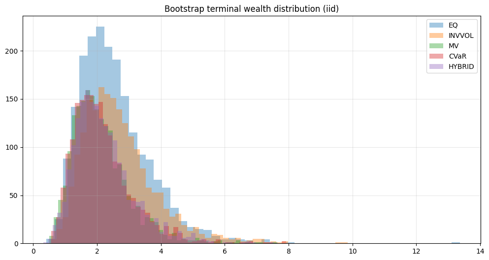
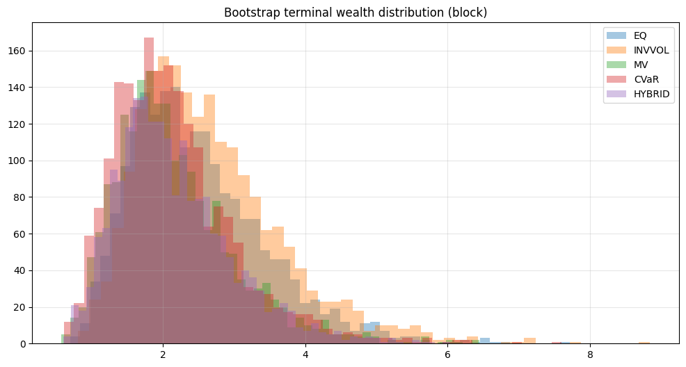
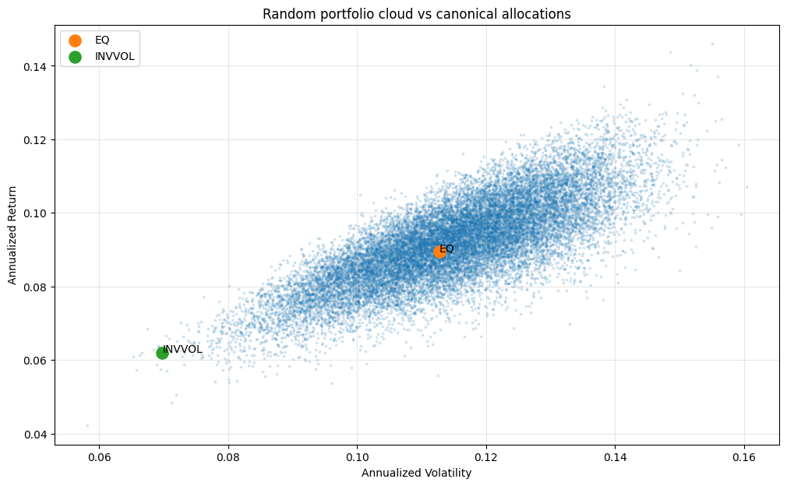
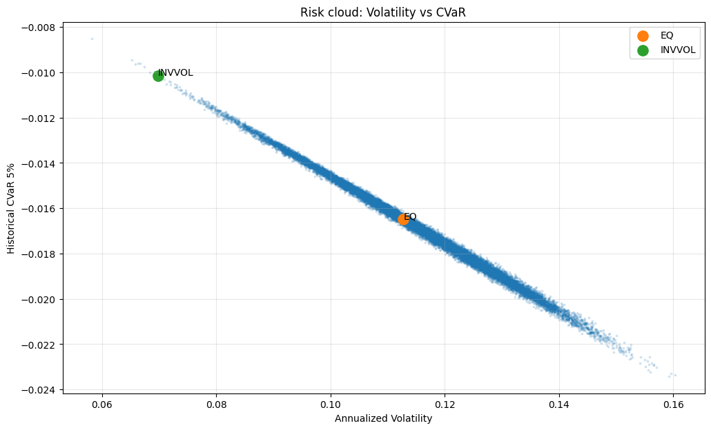
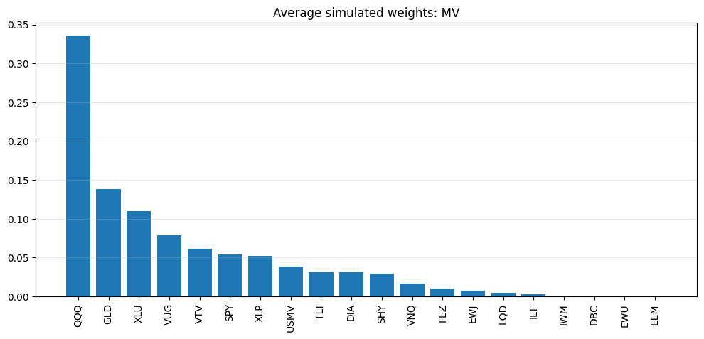
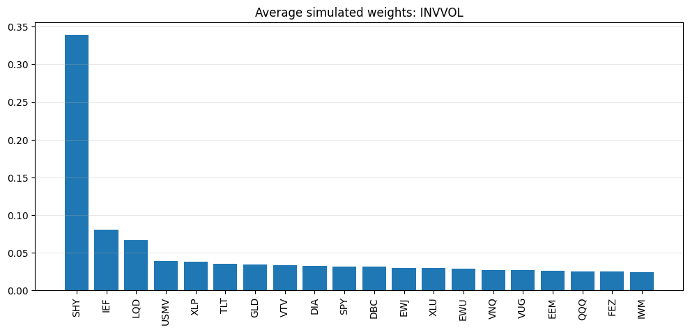
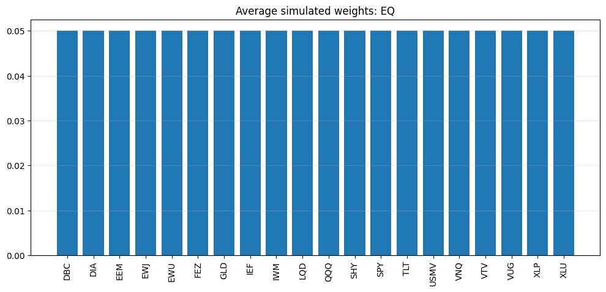

```python
%run 00setup.ipynb
```

    ✅ Setup complete
    


```python
from scipy.optimize import minimize

np.random.seed(42)
```


```python
MC_SEED = 42
N_BOOT = 2000
N_RANDOM_PORTS = 20000
N_INPUT_MC = 50
BLOCK_SIZE = 20
TRADING_DAYS = 252
ALPHA_CVAR = 0.05
HYBRID_LAMBDA = 0.80
MAX_W = 0.60
USE_LONG_ONLY = True

np.random.seed(MC_SEED)
```


```python
# -----------------------------
# Helpers
# -----------------------------
def annualized_return(ret: pd.Series, periods_per_year: int = TRADING_DAYS) -> float:
    ret = ret.dropna()
    if len(ret) == 0:
        return np.nan
    wealth = (1 + ret).prod()
    n_years = len(ret) / periods_per_year
    if n_years <= 0:
        return np.nan
    return wealth ** (1 / n_years) - 1

def annualized_vol(ret: pd.Series, periods_per_year: int = TRADING_DAYS) -> float:
    ret = ret.dropna()
    if len(ret) == 0:
        return np.nan
    return ret.std(ddof=1) * np.sqrt(periods_per_year)

def sharpe_ratio(ret: pd.Series, rf: float = 0.0, periods_per_year: int = TRADING_DAYS) -> float:
    ret = ret.dropna()
    if len(ret) < 2:
        return np.nan
    ann_ret = annualized_return(ret, periods_per_year)
    ann_vol = annualized_vol(ret, periods_per_year)
    if ann_vol == 0 or np.isnan(ann_vol):
        return np.nan
    return (ann_ret - rf) / ann_vol

def max_drawdown(ret: pd.Series) -> float:
    ret = ret.dropna()
    if len(ret) == 0:
        return np.nan
    wealth = (1 + ret).cumprod()
    peak = wealth.cummax()
    dd = wealth / peak - 1
    return dd.min()

def cvar_from_returns(ret: pd.Series, alpha: float = ALPHA_CVAR) -> float:
    ret = ret.dropna()
    if len(ret) == 0:
        return np.nan
    q = ret.quantile(alpha)
    tail = ret[ret <= q]
    if len(tail) == 0:
        return q
    return tail.mean()

def perf_summary(ret: pd.Series, name: str = None) -> pd.Series:
    out = pd.Series({
        "CAGR": annualized_return(ret),
        "AnnVol": annualized_vol(ret),
        "Sharpe": sharpe_ratio(ret),
        "MaxDD": max_drawdown(ret),
        "CVaR_5pct": cvar_from_returns(ret, alpha=0.05),
        "TerminalWealth": (1 + ret.dropna()).prod()
    })
    if name is not None:
        out.name = name
    return out
```


```python
def iid_bootstrap_returns(ret: pd.Series, n_boot: int = N_BOOT) -> pd.DataFrame:
    ret = ret.dropna().values
    T = len(ret)
    sims = np.empty((T, n_boot))
    for i in range(n_boot):
        idx = np.random.randint(0, T, size=T)
        sims[:, i] = ret[idx]
    return pd.DataFrame(sims)

def block_bootstrap_returns(ret: pd.Series, block_size: int = BLOCK_SIZE, n_boot: int = N_BOOT) -> pd.DataFrame:
    ret = ret.dropna().values
    T = len(ret)
    sims = np.empty((T, n_boot))
    n_blocks = int(np.ceil(T / block_size))
    
    for i in range(n_boot):
        sampled = []
        for _ in range(n_blocks):
            start = np.random.randint(0, max(1, T - block_size + 1))
            block = ret[start:start + block_size]
            sampled.extend(block.tolist())
        sims[:, i] = np.array(sampled[:T])
    
    return pd.DataFrame(sims)

def sim_perf_table(sim_df: pd.DataFrame, strategy_name: str, benchmark_ret: pd.Series = None) -> pd.DataFrame:
    rows = []
    for col in sim_df.columns:
        s = pd.Series(sim_df[col])
        row = perf_summary(s, name=col).to_dict()
        if benchmark_ret is not None:
            bench_tw = (1 + benchmark_ret.dropna()).prod()
            row["BeatBenchmark"] = row["TerminalWealth"] > bench_tw
        rows.append(row)
    out = pd.DataFrame(rows)
    out["Strategy"] = strategy_name
    return out
```


```python
# Random portfolio generation
def random_long_only_weights(n_assets: int, n_ports: int = N_RANDOM_PORTS) -> np.ndarray:
    w = np.random.dirichlet(alpha=np.ones(n_assets), size=n_ports)
    return w

def portfolio_moments(weights: np.ndarray, mu: np.ndarray, cov: np.ndarray):
    port_ret = weights @ mu
    port_vol = np.sqrt(np.einsum("ij,jk,ik->i", weights, cov, weights))
    return port_ret, port_vol

def portfolio_cvar_hist(weights: np.ndarray, ret_matrix: np.ndarray, alpha: float = ALPHA_CVAR) -> np.ndarray:
    # ret_matrix shape: T x N
    port_rets = ret_matrix @ weights.T   # T x M
    cvars = np.empty(port_rets.shape[1])
    for i in range(port_rets.shape[1]):
        r = pd.Series(port_rets[:, i])
        cvars[i] = cvar_from_returns(r, alpha=alpha)
    return cvars
```


```python
# Optimization helpers

def project_sum_to_one(w):
    w = np.asarray(w)
    s = w.sum()
    if s == 0:
        return np.ones_like(w) / len(w)
    return w / s

def apply_bounds_and_normalize(w, lb=0.0, ub=MAX_W):
    w = np.clip(w, lb, ub)
    return project_sum_to_one(w)

def solve_min_var(cov: np.ndarray, max_w: float = MAX_W) -> np.ndarray:
    n = cov.shape[0]
    x0 = np.ones(n) / n
    bounds = [(0.0, max_w) for _ in range(n)] if USE_LONG_ONLY else [(-1.0, 1.0) for _ in range(n)]
    cons = [{"type": "eq", "fun": lambda w: np.sum(w) - 1.0}]
    
    def obj(w):
        return w @ cov @ w
    
    res = minimize(obj, x0=x0, bounds=bounds, constraints=cons, method="SLSQP")
    if not res.success:
        return x0
    return res.x

def solve_mean_variance(mu: np.ndarray, cov: np.ndarray, risk_aversion: float = 5.0, max_w: float = MAX_W) -> np.ndarray:
    n = len(mu)
    x0 = np.ones(n) / n
    bounds = [(0.0, max_w) for _ in range(n)] if USE_LONG_ONLY else [(-1.0, 1.0) for _ in range(n)]
    cons = [{"type": "eq", "fun": lambda w: np.sum(w) - 1.0}]
    
    def obj(w):
        return -(w @ mu - 0.5 * risk_aversion * (w @ cov @ w))
    
    res = minimize(obj, x0=x0, bounds=bounds, constraints=cons, method="SLSQP")
    if not res.success:
        return x0
    return res.x

def solve_min_cvar_hist(ret_matrix: np.ndarray, alpha: float = ALPHA_CVAR, max_w: float = MAX_W) -> np.ndarray:
    # historical CVaR optimization using Rockafellar-Uryasev style formulation
    # ret_matrix shape: T x N
    T, n = ret_matrix.shape
    x0_w = np.ones(n) / n
    x0 = np.concatenate([x0_w, [0.0], np.zeros(T)])   # w, zeta, u
    
    bounds = [(0.0, max_w) for _ in range(n)] + [(None, None)] + [(0.0, None) for _ in range(T)]
    
    cons = [
        {"type": "eq", "fun": lambda x: np.sum(x[:n]) - 1.0}
    ]
    
    # u_t >= -r_p_t - zeta
    # implemented as u_t + r_p_t + zeta >= 0
    def scenario_constraints(x):
        w = x[:n]
        zeta = x[n]
        u = x[n+1:]
        port_ret = ret_matrix @ w
        return u + port_ret + zeta
    
    cons.append({"type": "ineq", "fun": scenario_constraints})
    
    def obj(x):
        zeta = x[n]
        u = x[n+1:]
        return -(zeta - (1 / (alpha * T)) * np.sum(u))  # maximizing tail mean of returns
    
    res = minimize(obj, x0=x0, bounds=bounds, constraints=cons, method="SLSQP", options={"maxiter": 500})
    
    if not res.success:
        return x0_w
    return res.x[:n]

def hybrid_mv_cvar(mu: np.ndarray, cov: np.ndarray, ret_matrix: np.ndarray,
                   lam: float = HYBRID_LAMBDA, max_w: float = MAX_W) -> np.ndarray:
    w_mv = solve_mean_variance(mu, cov, max_w=max_w)
    w_cvar = solve_min_cvar_hist(ret_matrix, max_w=max_w)
    w = lam * w_mv + (1 - lam) * w_cvar
    return apply_bounds_and_normalize(w, 0.0, max_w)
```


```python
# -----------------------------
# Load actual backtest outputs
# -----------------------------
prices = load_df("prices_clean", DATA_DIR, fmt="parquet")
prices["date"] = pd.to_datetime(prices["date"])
prices = prices.sort_values(["ticker", "date"]).reset_index(drop=True)

px_col = "adj_close"
prices["ret_1d"] = prices.groupby("ticker")[px_col].pct_change()

R = prices.pivot(index="date", columns="ticker", values="ret_1d").sort_index()
R = R.replace([np.inf, -np.inf], np.nan).dropna(how="all")

res_eq   = load_df("bt_eq_topk", DATA_DIR, fmt="parquet")
res_vp   = load_df("bt_invvol_topk", DATA_DIR, fmt="parquet")
res_mv   = load_df("bt_mv_topk", DATA_DIR, fmt="parquet")
res_cvar = load_df("bt_cvar_topk", DATA_DIR, fmt="parquet")
res_hyb  = load_df("bt_hybrid_topk", DATA_DIR, fmt="parquet")

for df in [res_eq, res_vp, res_mv, res_cvar, res_hyb]:
    df["date"] = pd.to_datetime(df["date"])
    df.set_index("date", inplace=True)
    df.sort_index(inplace=True)

# rebuild benchmark exactly as in your backtest
bench_eq_univ = R.mean(axis=1).fillna(0.0)

def vol_target(net_ret, target_vol=0.12, lookback=63):
    vol = net_ret.rolling(lookback).std() * np.sqrt(252)
    scale = (target_vol / vol).replace([np.inf, -np.inf], np.nan).clip(0, 3.0)
    scale = scale.shift(1).fillna(0.0)
    return net_ret * scale, scale

bench_eq_univ_vt, bench_eq_univ_scale = vol_target(bench_eq_univ, target_vol=0.12, lookback=63)
```


```python
# -----------------------------
# Build strategy return table from your actual saved outputs
# -----------------------------
strat_ret = pd.DataFrame({
    "EQ": res_eq["vt"],
    "INVVOL": res_vp["vt"],
    "MV": res_mv["vt"],
    "CVaR": res_cvar["vt"],
    "HYBRID": res_hyb["vt"],
    "BENCHMARK": bench_eq_univ_vt
}).sort_index()

asset_ret_wide = R.copy()

print("Strategy return columns:")
print(strat_ret.columns.tolist())
display(strat_ret.head())

print("Asset return matrix shape:", asset_ret_wide.shape)
display(asset_ret_wide.head())
```

    Strategy return columns:
    ['EQ', 'INVVOL', 'MV', 'CVaR', 'HYBRID', 'BENCHMARK']
    


<div>
<style scoped>
    .dataframe tbody tr th:only-of-type {
        vertical-align: middle;
    }

    .dataframe tbody tr th {
        vertical-align: top;
    }

    .dataframe thead th {
        text-align: right;
    }
</style>
<table border="1" class="dataframe">
  <thead>
    <tr style="text-align: right;">
      <th></th>
      <th>EQ</th>
      <th>INVVOL</th>
      <th>MV</th>
      <th>CVaR</th>
      <th>HYBRID</th>
      <th>BENCHMARK</th>
    </tr>
    <tr>
      <th>date</th>
      <th></th>
      <th></th>
      <th></th>
      <th></th>
      <th></th>
      <th></th>
    </tr>
  </thead>
  <tbody>
    <tr>
      <th>2011-10-21</th>
      <td>0.0</td>
      <td>0.0</td>
      <td>0.0</td>
      <td>0.0</td>
      <td>0.0</td>
      <td>0.0</td>
    </tr>
    <tr>
      <th>2011-10-24</th>
      <td>0.0</td>
      <td>0.0</td>
      <td>0.0</td>
      <td>0.0</td>
      <td>0.0</td>
      <td>0.0</td>
    </tr>
    <tr>
      <th>2011-10-25</th>
      <td>0.0</td>
      <td>0.0</td>
      <td>0.0</td>
      <td>0.0</td>
      <td>0.0</td>
      <td>-0.0</td>
    </tr>
    <tr>
      <th>2011-10-26</th>
      <td>0.0</td>
      <td>0.0</td>
      <td>0.0</td>
      <td>0.0</td>
      <td>0.0</td>
      <td>0.0</td>
    </tr>
    <tr>
      <th>2011-10-27</th>
      <td>0.0</td>
      <td>0.0</td>
      <td>0.0</td>
      <td>0.0</td>
      <td>0.0</td>
      <td>0.0</td>
    </tr>
  </tbody>
</table>
</div>


    Asset return matrix shape: (3568, 20)
    


<div>
<style scoped>
    .dataframe tbody tr th:only-of-type {
        vertical-align: middle;
    }

    .dataframe tbody tr th {
        vertical-align: top;
    }

    .dataframe thead th {
        text-align: right;
    }
</style>
<table border="1" class="dataframe">
  <thead>
    <tr style="text-align: right;">
      <th>ticker</th>
      <th>DBC</th>
      <th>DIA</th>
      <th>EEM</th>
      <th>EWJ</th>
      <th>EWU</th>
      <th>FEZ</th>
      <th>GLD</th>
      <th>IEF</th>
      <th>IWM</th>
      <th>LQD</th>
      <th>QQQ</th>
      <th>SHY</th>
      <th>SPY</th>
      <th>TLT</th>
      <th>USMV</th>
      <th>VNQ</th>
      <th>VTV</th>
      <th>VUG</th>
      <th>XLP</th>
      <th>XLU</th>
    </tr>
    <tr>
      <th>date</th>
      <th></th>
      <th></th>
      <th></th>
      <th></th>
      <th></th>
      <th></th>
      <th></th>
      <th></th>
      <th></th>
      <th></th>
      <th></th>
      <th></th>
      <th></th>
      <th></th>
      <th></th>
      <th></th>
      <th></th>
      <th></th>
      <th></th>
      <th></th>
    </tr>
  </thead>
  <tbody>
    <tr>
      <th>2011-10-21</th>
      <td>0.005177</td>
      <td>0.023492</td>
      <td>0.028586</td>
      <td>0.010537</td>
      <td>0.023500</td>
      <td>0.031654</td>
      <td>0.011092</td>
      <td>-0.001847</td>
      <td>0.021688</td>
      <td>0.003286</td>
      <td>0.012546</td>
      <td>-0.000355</td>
      <td>0.018987</td>
      <td>-0.010582</td>
      <td>0.012224</td>
      <td>0.032958</td>
      <td>0.018269</td>
      <td>0.020232</td>
      <td>0.016145</td>
      <td>0.016910</td>
    </tr>
    <tr>
      <th>2011-10-24</th>
      <td>0.015820</td>
      <td>0.008739</td>
      <td>0.039115</td>
      <td>0.010427</td>
      <td>0.013897</td>
      <td>0.014715</td>
      <td>0.009403</td>
      <td>-0.000487</td>
      <td>0.032195</td>
      <td>0.005134</td>
      <td>0.020768</td>
      <td>0.000000</td>
      <td>0.012261</td>
      <td>0.001679</td>
      <td>NaN</td>
      <td>0.024837</td>
      <td>0.012285</td>
      <td>0.016580</td>
      <td>-0.006990</td>
      <td>-0.004300</td>
    </tr>
    <tr>
      <th>2011-10-25</th>
      <td>0.003260</td>
      <td>-0.017581</td>
      <td>-0.019812</td>
      <td>-0.014448</td>
      <td>-0.012515</td>
      <td>-0.019747</td>
      <td>0.028382</td>
      <td>0.008573</td>
      <td>-0.028058</td>
      <td>0.004933</td>
      <td>-0.019662</td>
      <td>0.000591</td>
      <td>-0.019444</td>
      <td>0.025415</td>
      <td>-0.003506</td>
      <td>-0.016274</td>
      <td>-0.020227</td>
      <td>-0.019827</td>
      <td>-0.011840</td>
      <td>-0.011229</td>
    </tr>
    <tr>
      <th>2011-10-26</th>
      <td>-0.005776</td>
      <td>0.013871</td>
      <td>0.018444</td>
      <td>0.002094</td>
      <td>0.016295</td>
      <td>0.012590</td>
      <td>0.010931</td>
      <td>-0.007341</td>
      <td>0.017236</td>
      <td>-0.000702</td>
      <td>-0.001221</td>
      <td>-0.000591</td>
      <td>0.010159</td>
      <td>-0.017470</td>
      <td>0.004300</td>
      <td>0.007373</td>
      <td>0.014156</td>
      <td>0.006688</td>
      <td>0.010039</td>
      <td>0.004076</td>
    </tr>
    <tr>
      <th>2011-10-27</th>
      <td>0.026507</td>
      <td>0.029812</td>
      <td>0.060779</td>
      <td>0.038662</td>
      <td>0.039193</td>
      <td>0.085483</td>
      <td>0.012844</td>
      <td>-0.012066</td>
      <td>0.052762</td>
      <td>-0.000175</td>
      <td>0.027588</td>
      <td>-0.000710</td>
      <td>0.034835</td>
      <td>-0.033897</td>
      <td>0.013234</td>
      <td>0.047483</td>
      <td>0.035091</td>
      <td>0.031923</td>
      <td>0.012825</td>
      <td>0.023782</td>
    </tr>
  </tbody>
</table>
</div>


```python
STRATEGY_COLS = ["EQ", "INVVOL", "MV", "CVaR", "HYBRID"]
BENCH_COL = "BENCHMARK"
live_mask = strat_ret[STRATEGY_COLS].abs().sum(axis=1) > 1e-12
common_start = strat_ret.index[live_mask][0]
print("Strategy cols:", STRATEGY_COLS)
print("Benchmark col:", BENCH_COL)
```

    Strategy cols: ['EQ', 'INVVOL', 'MV', 'CVaR', 'HYBRID']
    Benchmark col: BENCHMARK
    


```python
# Basic summary of realized OOS performance

if strat_ret is not None:
    base_summary = pd.concat(
        [perf_summary(strat_ret[c], name=c) for c in STRATEGY_COLS + ([BENCH_COL] if BENCH_COL else [])],
        axis=1
    ).T
    display(base_summary.round(4))
    
    save_df(base_summary.reset_index().rename(columns={"index": "strategy"}), "base summary", DATA_DIR ,fmt="parquet")
```


<div>
<style scoped>
    .dataframe tbody tr th:only-of-type {
        vertical-align: middle;
    }

    .dataframe tbody tr th {
        vertical-align: top;
    }

    .dataframe thead th {
        text-align: right;
    }
</style>
<table border="1" class="dataframe">
  <thead>
    <tr style="text-align: right;">
      <th></th>
      <th>CAGR</th>
      <th>AnnVol</th>
      <th>Sharpe</th>
      <th>MaxDD</th>
      <th>CVaR_5pct</th>
      <th>TerminalWealth</th>
    </tr>
  </thead>
  <tbody>
    <tr>
      <th>EQ</th>
      <td>0.0607</td>
      <td>0.1097</td>
      <td>0.5530</td>
      <td>-0.2188</td>
      <td>-0.0174</td>
      <td>2.3026</td>
    </tr>
    <tr>
      <th>INVVOL</th>
      <td>0.0668</td>
      <td>0.1097</td>
      <td>0.6091</td>
      <td>-0.2160</td>
      <td>-0.0174</td>
      <td>2.4996</td>
    </tr>
    <tr>
      <th>MV</th>
      <td>0.0495</td>
      <td>0.1096</td>
      <td>0.4520</td>
      <td>-0.2206</td>
      <td>-0.0174</td>
      <td>1.9830</td>
    </tr>
    <tr>
      <th>CVaR</th>
      <td>0.0498</td>
      <td>0.1098</td>
      <td>0.4535</td>
      <td>-0.2490</td>
      <td>-0.0173</td>
      <td>1.9898</td>
    </tr>
    <tr>
      <th>HYBRID</th>
      <td>0.0502</td>
      <td>0.1097</td>
      <td>0.4579</td>
      <td>-0.2246</td>
      <td>-0.0174</td>
      <td>2.0016</td>
    </tr>
    <tr>
      <th>BENCHMARK</th>
      <td>0.0989</td>
      <td>0.1275</td>
      <td>0.7755</td>
      <td>-0.2267</td>
      <td>-0.0196</td>
      <td>3.8010</td>
    </tr>
  </tbody>
</table>
</div>


```python
# -----------------------------
# 1) Bootstrap robustness
# -----------------------------
boot_results = []

if strat_ret is not None:
    benchmark_ret = strat_ret[BENCH_COL] if BENCH_COL else None
    
    for c in STRATEGY_COLS:
        s = strat_ret[c].dropna()
        
        iid_sims = iid_bootstrap_returns(s, n_boot=N_BOOT)
        iid_perf = sim_perf_table(iid_sims, strategy_name=f"{c}_iid", benchmark_ret=benchmark_ret)
        iid_perf["BootstrapType"] = "iid"
        iid_perf["BaseStrategy"] = c
        
        block_sims = block_bootstrap_returns(s, block_size=BLOCK_SIZE, n_boot=N_BOOT)
        block_perf = sim_perf_table(block_sims, strategy_name=f"{c}_block", benchmark_ret=benchmark_ret)
        block_perf["BootstrapType"] = "block"
        block_perf["BaseStrategy"] = c
        
        boot_results.append(iid_perf)
        boot_results.append(block_perf)

boot_results_df = pd.concat(boot_results, axis=0, ignore_index=True) if len(boot_results) > 0 else pd.DataFrame()
display(boot_results_df.head())
```


<div>
<style scoped>
    .dataframe tbody tr th:only-of-type {
        vertical-align: middle;
    }

    .dataframe tbody tr th {
        vertical-align: top;
    }

    .dataframe thead th {
        text-align: right;
    }
</style>
<table border="1" class="dataframe">
  <thead>
    <tr style="text-align: right;">
      <th></th>
      <th>CAGR</th>
      <th>AnnVol</th>
      <th>Sharpe</th>
      <th>MaxDD</th>
      <th>CVaR_5pct</th>
      <th>TerminalWealth</th>
      <th>BeatBenchmark</th>
      <th>Strategy</th>
      <th>BootstrapType</th>
      <th>BaseStrategy</th>
    </tr>
  </thead>
  <tbody>
    <tr>
      <th>0</th>
      <td>0.083277</td>
      <td>0.105479</td>
      <td>0.789513</td>
      <td>-0.215449</td>
      <td>-0.016343</td>
      <td>3.103616</td>
      <td>False</td>
      <td>EQ_iid</td>
      <td>iid</td>
      <td>EQ</td>
    </tr>
    <tr>
      <th>1</th>
      <td>0.016345</td>
      <td>0.103826</td>
      <td>0.157430</td>
      <td>-0.281698</td>
      <td>-0.017352</td>
      <td>1.258045</td>
      <td>False</td>
      <td>EQ_iid</td>
      <td>iid</td>
      <td>EQ</td>
    </tr>
    <tr>
      <th>2</th>
      <td>0.038140</td>
      <td>0.108102</td>
      <td>0.352819</td>
      <td>-0.341823</td>
      <td>-0.017975</td>
      <td>1.698889</td>
      <td>False</td>
      <td>EQ_iid</td>
      <td>iid</td>
      <td>EQ</td>
    </tr>
    <tr>
      <th>3</th>
      <td>0.090090</td>
      <td>0.101065</td>
      <td>0.891407</td>
      <td>-0.287605</td>
      <td>-0.015509</td>
      <td>3.391705</td>
      <td>False</td>
      <td>EQ_iid</td>
      <td>iid</td>
      <td>EQ</td>
    </tr>
    <tr>
      <th>4</th>
      <td>0.071186</td>
      <td>0.108082</td>
      <td>0.658632</td>
      <td>-0.232786</td>
      <td>-0.016679</td>
      <td>2.647585</td>
      <td>False</td>
      <td>EQ_iid</td>
      <td>iid</td>
      <td>EQ</td>
    </tr>
  </tbody>
</table>
</div>


```python
# Plot bootstrap terminal wealth distributions

if not boot_results_df.empty:
    for btype in ["iid", "block"]:
        sub = boot_results_df[boot_results_df["BootstrapType"] == btype]
        plt.figure(figsize=(12, 6))
        for strat in sub["BaseStrategy"].unique():
            vals = sub.loc[sub["BaseStrategy"] == strat, "TerminalWealth"].dropna()
            plt.hist(vals, bins=50, alpha=0.4, label=strat)
        plt.title(f"Bootstrap terminal wealth distribution ({btype})")
        plt.legend()
        plt.grid(True, alpha=0.3)
        plt.show()
```


    

    


    

    


```python
# Compact robustness table for presentation/report

if not boot_results_df.empty:
    robust_table = (
        boot_results_df
        .groupby(["BaseStrategy", "BootstrapType"])
        .agg(
            CAGR_p5=("CAGR", lambda x: x.quantile(0.05)),
            CAGR_med=("CAGR", "median"),
            CAGR_p95=("CAGR", lambda x: x.quantile(0.95)),
            Sharpe_p5=("Sharpe", lambda x: x.quantile(0.05)),
            Sharpe_med=("Sharpe", "median"),
            Sharpe_p95=("Sharpe", lambda x: x.quantile(0.95)),
            MaxDD_med=("MaxDD", "median"),
            TW_p5=("TerminalWealth", lambda x: x.quantile(0.05)),
            TW_med=("TerminalWealth", "median"),
            TW_p95=("TerminalWealth", lambda x: x.quantile(0.95)),
        )
        .reset_index()
    )
    if "BeatBenchmark" in boot_results_df.columns:
        beat = (
            boot_results_df
            .groupby(["BaseStrategy", "BootstrapType"])["BeatBenchmark"]
            .mean()
            .reset_index(name="ProbBeatBenchmark")
        )
        robust_table = robust_table.merge(beat, on=["BaseStrategy", "BootstrapType"], how="left")
    
    display(robust_table.round(4))
    save_df(robust_table,"bootstrap_summary", DATA_DIR, fmt="parquet" )
```


<div>
<style scoped>
    .dataframe tbody tr th:only-of-type {
        vertical-align: middle;
    }

    .dataframe tbody tr th {
        vertical-align: top;
    }

    .dataframe thead th {
        text-align: right;
    }
</style>
<table border="1" class="dataframe">
  <thead>
    <tr style="text-align: right;">
      <th></th>
      <th>BaseStrategy</th>
      <th>BootstrapType</th>
      <th>CAGR_p5</th>
      <th>CAGR_med</th>
      <th>CAGR_p95</th>
      <th>Sharpe_p5</th>
      <th>Sharpe_med</th>
      <th>Sharpe_p95</th>
      <th>MaxDD_med</th>
      <th>TW_p5</th>
      <th>TW_med</th>
      <th>TW_p95</th>
      <th>ProbBeatBenchmark</th>
    </tr>
  </thead>
  <tbody>
    <tr>
      <th>0</th>
      <td>CVaR</td>
      <td>block</td>
      <td>0.0037</td>
      <td>0.0506</td>
      <td>0.0985</td>
      <td>0.0349</td>
      <td>0.4625</td>
      <td>0.9174</td>
      <td>-0.2355</td>
      <td>1.0543</td>
      <td>2.0109</td>
      <td>3.7798</td>
      <td>0.0490</td>
    </tr>
    <tr>
      <th>1</th>
      <td>CVaR</td>
      <td>iid</td>
      <td>0.0010</td>
      <td>0.0500</td>
      <td>0.1011</td>
      <td>0.0089</td>
      <td>0.4546</td>
      <td>0.9501</td>
      <td>-0.2525</td>
      <td>1.0145</td>
      <td>1.9941</td>
      <td>3.9109</td>
      <td>0.0580</td>
    </tr>
    <tr>
      <th>2</th>
      <td>EQ</td>
      <td>block</td>
      <td>0.0169</td>
      <td>0.0615</td>
      <td>0.1083</td>
      <td>0.1541</td>
      <td>0.5616</td>
      <td>1.0053</td>
      <td>-0.2184</td>
      <td>1.2686</td>
      <td>2.3289</td>
      <td>4.2892</td>
      <td>0.0925</td>
    </tr>
    <tr>
      <th>3</th>
      <td>EQ</td>
      <td>iid</td>
      <td>0.0105</td>
      <td>0.0626</td>
      <td>0.1134</td>
      <td>0.0931</td>
      <td>0.5661</td>
      <td>1.0554</td>
      <td>-0.2391</td>
      <td>1.1601</td>
      <td>2.3625</td>
      <td>4.5782</td>
      <td>0.1280</td>
    </tr>
    <tr>
      <th>4</th>
      <td>HYBRID</td>
      <td>block</td>
      <td>0.0058</td>
      <td>0.0506</td>
      <td>0.0962</td>
      <td>0.0507</td>
      <td>0.4637</td>
      <td>0.9046</td>
      <td>-0.2330</td>
      <td>1.0848</td>
      <td>2.0123</td>
      <td>3.6703</td>
      <td>0.0405</td>
    </tr>
    <tr>
      <th>5</th>
      <td>HYBRID</td>
      <td>iid</td>
      <td>0.0032</td>
      <td>0.0520</td>
      <td>0.1026</td>
      <td>0.0296</td>
      <td>0.4768</td>
      <td>0.9594</td>
      <td>-0.2534</td>
      <td>1.0459</td>
      <td>2.0498</td>
      <td>3.9884</td>
      <td>0.0645</td>
    </tr>
    <tr>
      <th>6</th>
      <td>INVVOL</td>
      <td>block</td>
      <td>0.0229</td>
      <td>0.0658</td>
      <td>0.1136</td>
      <td>0.2101</td>
      <td>0.6045</td>
      <td>1.0676</td>
      <td>-0.2157</td>
      <td>1.3785</td>
      <td>2.4653</td>
      <td>4.5898</td>
      <td>0.1215</td>
    </tr>
    <tr>
      <th>7</th>
      <td>INVVOL</td>
      <td>iid</td>
      <td>0.0175</td>
      <td>0.0669</td>
      <td>0.1183</td>
      <td>0.1602</td>
      <td>0.6111</td>
      <td>1.0964</td>
      <td>-0.2336</td>
      <td>1.2792</td>
      <td>2.5004</td>
      <td>4.8685</td>
      <td>0.1475</td>
    </tr>
    <tr>
      <th>8</th>
      <td>MV</td>
      <td>block</td>
      <td>0.0054</td>
      <td>0.0503</td>
      <td>0.0969</td>
      <td>0.0485</td>
      <td>0.4578</td>
      <td>0.9203</td>
      <td>-0.2318</td>
      <td>1.0788</td>
      <td>2.0028</td>
      <td>3.7025</td>
      <td>0.0480</td>
    </tr>
    <tr>
      <th>9</th>
      <td>MV</td>
      <td>iid</td>
      <td>0.0003</td>
      <td>0.0487</td>
      <td>0.0983</td>
      <td>0.0028</td>
      <td>0.4438</td>
      <td>0.9068</td>
      <td>-0.2560</td>
      <td>1.0042</td>
      <td>1.9602</td>
      <td>3.7706</td>
      <td>0.0485</td>
    </tr>
  </tbody>
</table>
</div>


```python
common_idx = strat_ret.dropna().index
asset_ret_wide = asset_ret_wide.reindex(common_idx).dropna(how="any")
strat_ret = strat_ret.reindex(common_idx).dropna(how="any")
```


```python
# -----------------------------
# 2) Random portfolio cloud
# -----------------------------
if asset_ret_wide is not None:
    # use realized full-sample OOS asset returns as the cloud input
    rp_ret = asset_ret_wide.dropna(how="any").copy()
    mu_hat = rp_ret.mean().values * TRADING_DAYS
    cov_hat = rp_ret.cov().values * TRADING_DAYS
    assets = rp_ret.columns.tolist()
    
    rand_w = random_long_only_weights(len(assets), n_ports=N_RANDOM_PORTS)
    rand_ret, rand_vol = portfolio_moments(rand_w, mu_hat, cov_hat)
    rand_cvar = portfolio_cvar_hist(rand_w, rp_ret.values, alpha=ALPHA_CVAR)
    
    random_cloud = pd.DataFrame({
        "AnnReturn": rand_ret,
        "AnnVol": rand_vol,
        "Sharpe": np.where(rand_vol > 0, rand_ret / rand_vol, np.nan),
        "CVaR_5pct": rand_cvar
    })
    
    display(random_cloud.head())
    save_df(random_cloud, "random_portfolio_cloud",DATA_DIR, fmt="parquet" )
```


<div>
<style scoped>
    .dataframe tbody tr th:only-of-type {
        vertical-align: middle;
    }

    .dataframe tbody tr th {
        vertical-align: top;
    }

    .dataframe thead th {
        text-align: right;
    }
</style>
<table border="1" class="dataframe">
  <thead>
    <tr style="text-align: right;">
      <th></th>
      <th>AnnReturn</th>
      <th>AnnVol</th>
      <th>Sharpe</th>
      <th>CVaR_5pct</th>
    </tr>
  </thead>
  <tbody>
    <tr>
      <th>0</th>
      <td>0.089868</td>
      <td>0.119775</td>
      <td>0.750310</td>
      <td>-0.017509</td>
    </tr>
    <tr>
      <th>1</th>
      <td>0.064954</td>
      <td>0.074640</td>
      <td>0.870237</td>
      <td>-0.010877</td>
    </tr>
    <tr>
      <th>2</th>
      <td>0.099817</td>
      <td>0.118972</td>
      <td>0.839003</td>
      <td>-0.017558</td>
    </tr>
    <tr>
      <th>3</th>
      <td>0.077497</td>
      <td>0.106158</td>
      <td>0.730016</td>
      <td>-0.015795</td>
    </tr>
    <tr>
      <th>4</th>
      <td>0.091057</td>
      <td>0.107554</td>
      <td>0.846611</td>
      <td>-0.015660</td>
    </tr>
  </tbody>
</table>
</div>


```python
# Solve canonical portfolios on the same input set
canonical_weights = {}

if asset_ret_wide is not None:
    eps = 1e-4
    cov_hat_stable = cov_hat + eps * np.eye(cov_hat.shape[0])

    w_eq = np.ones(len(assets)) / len(assets)

    w_iv = 1 / np.sqrt(np.diag(cov_hat_stable))
    w_iv = w_iv / w_iv.sum()
    w_iv = apply_bounds_and_normalize(w_iv, 0.0, MAX_W)

    canonical_weights["EQ"] = w_eq
    canonical_weights["INVVOL"] = w_iv

    cw_df = pd.DataFrame(canonical_weights, index=assets)
    display(cw_df.round(4))
```


<div>
<style scoped>
    .dataframe tbody tr th:only-of-type {
        vertical-align: middle;
    }

    .dataframe tbody tr th {
        vertical-align: top;
    }

    .dataframe thead th {
        text-align: right;
    }
</style>
<table border="1" class="dataframe">
  <thead>
    <tr style="text-align: right;">
      <th></th>
      <th>EQ</th>
      <th>INVVOL</th>
    </tr>
  </thead>
  <tbody>
    <tr>
      <th>DBC</th>
      <td>0.05</td>
      <td>0.0323</td>
    </tr>
    <tr>
      <th>DIA</th>
      <td>0.05</td>
      <td>0.0330</td>
    </tr>
    <tr>
      <th>EEM</th>
      <td>0.05</td>
      <td>0.0266</td>
    </tr>
    <tr>
      <th>EWJ</th>
      <td>0.05</td>
      <td>0.0309</td>
    </tr>
    <tr>
      <th>EWU</th>
      <td>0.05</td>
      <td>0.0294</td>
    </tr>
    <tr>
      <th>FEZ</th>
      <td>0.05</td>
      <td>0.0250</td>
    </tr>
    <tr>
      <th>GLD</th>
      <td>0.05</td>
      <td>0.0347</td>
    </tr>
    <tr>
      <th>IEF</th>
      <td>0.05</td>
      <td>0.0827</td>
    </tr>
    <tr>
      <th>IWM</th>
      <td>0.05</td>
      <td>0.0251</td>
    </tr>
    <tr>
      <th>LQD</th>
      <td>0.05</td>
      <td>0.0684</td>
    </tr>
    <tr>
      <th>QQQ</th>
      <td>0.05</td>
      <td>0.0262</td>
    </tr>
    <tr>
      <th>SHY</th>
      <td>0.05</td>
      <td>0.3189</td>
    </tr>
    <tr>
      <th>SPY</th>
      <td>0.05</td>
      <td>0.0320</td>
    </tr>
    <tr>
      <th>TLT</th>
      <td>0.05</td>
      <td>0.0366</td>
    </tr>
    <tr>
      <th>USMV</th>
      <td>0.05</td>
      <td>0.0396</td>
    </tr>
    <tr>
      <th>VNQ</th>
      <td>0.05</td>
      <td>0.0278</td>
    </tr>
    <tr>
      <th>VTV</th>
      <td>0.05</td>
      <td>0.0339</td>
    </tr>
    <tr>
      <th>VUG</th>
      <td>0.05</td>
      <td>0.0275</td>
    </tr>
    <tr>
      <th>XLP</th>
      <td>0.05</td>
      <td>0.0391</td>
    </tr>
    <tr>
      <th>XLU</th>
      <td>0.05</td>
      <td>0.0304</td>
    </tr>
  </tbody>
</table>
</div>


```python
rows = []
for name, w in canonical_weights.items():
    pr = rp_ret.values @ w
    rows.append({
        "Portfolio": name,
        "AnnReturn": annualized_return(pd.Series(pr)),
        "AnnVol": annualized_vol(pd.Series(pr)),
        "Sharpe": sharpe_ratio(pd.Series(pr)),
        "CVaR_5pct": cvar_from_returns(pd.Series(pr), alpha=ALPHA_CVAR),
        "MaxDD": max_drawdown(pd.Series(pr))
    })
canonical_stats = pd.DataFrame(rows)
display(canonical_stats.round(4))
```


<div>
<style scoped>
    .dataframe tbody tr th:only-of-type {
        vertical-align: middle;
    }

    .dataframe tbody tr th {
        vertical-align: top;
    }

    .dataframe thead th {
        text-align: right;
    }
</style>
<table border="1" class="dataframe">
  <thead>
    <tr style="text-align: right;">
      <th></th>
      <th>Portfolio</th>
      <th>AnnReturn</th>
      <th>AnnVol</th>
      <th>Sharpe</th>
      <th>CVaR_5pct</th>
      <th>MaxDD</th>
    </tr>
  </thead>
  <tbody>
    <tr>
      <th>0</th>
      <td>EQ</td>
      <td>0.0895</td>
      <td>0.1127</td>
      <td>0.7935</td>
      <td>-0.0165</td>
      <td>-0.2532</td>
    </tr>
    <tr>
      <th>1</th>
      <td>INVVOL</td>
      <td>0.0620</td>
      <td>0.0698</td>
      <td>0.8881</td>
      <td>-0.0101</td>
      <td>-0.1545</td>
    </tr>
  </tbody>
</table>
</div>


```python
# Plot return-volatility cloud with canonical portfolios

if asset_ret_wide is not None:
    plt.figure(figsize=(12, 7))
    plt.scatter(random_cloud["AnnVol"], random_cloud["AnnReturn"], s=3, alpha=0.15)
    
    for _, row in canonical_stats.iterrows():
        plt.scatter(row["AnnVol"], row["AnnReturn"], s=120, label=row["Portfolio"])
        plt.text(row["AnnVol"], row["AnnReturn"], row["Portfolio"])
    
    plt.xlabel("Annualized Volatility")
    plt.ylabel("Annualized Return")
    plt.title("Random portfolio cloud vs canonical allocations")
    plt.grid(True, alpha=0.3)
    plt.legend()
    plt.show()
```


    

    


```python
# Plot volatility vs CVaR cloud

if asset_ret_wide is not None:
    plt.figure(figsize=(12, 7))
    plt.scatter(random_cloud["AnnVol"], random_cloud["CVaR_5pct"], s=3, alpha=0.15)
    
    for name, w in canonical_weights.items():
        pr = pd.Series(rp_ret.values @ w)
        x = annualized_vol(pr)
        y = cvar_from_returns(pr, alpha=ALPHA_CVAR)
        plt.scatter(x, y, s=120, label=name)
        plt.text(x, y, name)
    
    plt.xlabel("Annualized Volatility")
    plt.ylabel("Historical CVaR 5%")
    plt.title("Risk cloud: Volatility vs CVaR")
    plt.grid(True, alpha=0.3)
    plt.legend()
    plt.show()
```


    

    


```python
# -----------------------------
# 3) Input-uncertainty Monte Carlo
# -----------------------------
# Idea:
# perturb estimated means/covariances through resampling
# re-solve MV / CVaR / HYBRID
# study stability, concentration, and turnover

input_mc_rows = []
weight_store = []

if asset_ret_wide is not None:
    base_ret = rp_ret.copy()
    T, N = base_ret.shape

    for i in range(N_INPUT_MC):
        # block bootstrap row indices
        idx_blocks = []
        n_blocks = int(np.ceil(T / BLOCK_SIZE))
        for _ in range(n_blocks):
            start = np.random.randint(0, max(1, T - BLOCK_SIZE + 1))
            idx_blocks.extend(range(start, min(start + BLOCK_SIZE, T)))
        idx = idx_blocks[:T]

        sim_ret = base_ret.iloc[idx].reset_index(drop=True)

        # estimate moments from resampled data
        mu_sim = sim_ret.mean().values * TRADING_DAYS
        cov_sim = sim_ret.cov().values * TRADING_DAYS

        # perturb means slightly to reflect estimation noise
        mu_noise = np.random.normal(
            0, np.maximum(np.abs(mu_sim), 1e-6) * 0.10, size=N
        )
        mu_pert = mu_sim + mu_noise

        # stabilize covariance
        cov_jitter = np.diag(np.random.uniform(1e-6, 1e-4, size=N))
        cov_pert = cov_sim + cov_jitter

        # portfolios
        w_eq = np.ones(N) / N

        invvol = 1 / np.sqrt(np.clip(np.diag(cov_pert), 1e-12, None))
        w_iv = invvol / invvol.sum()
        w_iv = apply_bounds_and_normalize(w_iv, 0.0, MAX_W)

        w_mv = solve_mean_variance(mu_pert, cov_pert, max_w=MAX_W)

        for name, w in {"EQ": w_eq, "INVVOL": w_iv, "MV": w_mv}.items():
            pr = pd.Series(base_ret.values @ w)

            input_mc_rows.append({
                "Sim": i,
                "Portfolio": name,
                "AnnReturn": annualized_return(pr),
                "AnnVol": annualized_vol(pr),
                "Sharpe": sharpe_ratio(pr),
                "CVaR_5pct": cvar_from_returns(pr, alpha=ALPHA_CVAR),
                "MaxDD": max_drawdown(pr),
                "MaxWeight": np.max(w),
                "HHI": np.sum(w**2),
                "NumWeightsOver20": np.sum(w > 0.20)
            })

            for a, ww in zip(assets, w):
                weight_store.append({
                    "Sim": i,
                    "Portfolio": name,
                    "Asset": a,
                    "Weight": ww
                })

input_mc_df = pd.DataFrame(input_mc_rows)
weight_store_df = pd.DataFrame(weight_store)

display(input_mc_df.head())
display(weight_store_df.head())

save_df(input_mc_df, "input_uncertainty_mc_stats", DATA_DIR, fmt="parquet")
save_df(weight_store_df, "input_uncertainty_mc_weights", DATA_DIR, fmt="parquet")
```


<div>
<style scoped>
    .dataframe tbody tr th:only-of-type {
        vertical-align: middle;
    }

    .dataframe tbody tr th {
        vertical-align: top;
    }

    .dataframe thead th {
        text-align: right;
    }
</style>
<table border="1" class="dataframe">
  <thead>
    <tr style="text-align: right;">
      <th></th>
      <th>Sim</th>
      <th>Portfolio</th>
      <th>AnnReturn</th>
      <th>AnnVol</th>
      <th>Sharpe</th>
      <th>CVaR_5pct</th>
      <th>MaxDD</th>
      <th>MaxWeight</th>
      <th>HHI</th>
      <th>NumWeightsOver20</th>
    </tr>
  </thead>
  <tbody>
    <tr>
      <th>0</th>
      <td>0</td>
      <td>EQ</td>
      <td>0.089457</td>
      <td>0.112745</td>
      <td>0.793450</td>
      <td>-0.016464</td>
      <td>-0.253237</td>
      <td>0.050000</td>
      <td>0.050000</td>
      <td>0</td>
    </tr>
    <tr>
      <th>1</th>
      <td>0</td>
      <td>INVVOL</td>
      <td>0.061228</td>
      <td>0.068493</td>
      <td>0.893922</td>
      <td>-0.009953</td>
      <td>-0.151671</td>
      <td>0.338528</td>
      <td>0.141026</td>
      <td>1</td>
    </tr>
    <tr>
      <th>2</th>
      <td>0</td>
      <td>MV</td>
      <td>0.142070</td>
      <td>0.140365</td>
      <td>1.012147</td>
      <td>-0.020553</td>
      <td>-0.259344</td>
      <td>0.548651</td>
      <td>0.434907</td>
      <td>2</td>
    </tr>
    <tr>
      <th>3</th>
      <td>1</td>
      <td>EQ</td>
      <td>0.089457</td>
      <td>0.112745</td>
      <td>0.793450</td>
      <td>-0.016464</td>
      <td>-0.253237</td>
      <td>0.050000</td>
      <td>0.050000</td>
      <td>0</td>
    </tr>
    <tr>
      <th>4</th>
      <td>1</td>
      <td>INVVOL</td>
      <td>0.062014</td>
      <td>0.070013</td>
      <td>0.885758</td>
      <td>-0.010180</td>
      <td>-0.155007</td>
      <td>0.323785</td>
      <td>0.132271</td>
      <td>1</td>
    </tr>
  </tbody>
</table>
</div>


<div>
<style scoped>
    .dataframe tbody tr th:only-of-type {
        vertical-align: middle;
    }

    .dataframe tbody tr th {
        vertical-align: top;
    }

    .dataframe thead th {
        text-align: right;
    }
</style>
<table border="1" class="dataframe">
  <thead>
    <tr style="text-align: right;">
      <th></th>
      <th>Sim</th>
      <th>Portfolio</th>
      <th>Asset</th>
      <th>Weight</th>
    </tr>
  </thead>
  <tbody>
    <tr>
      <th>0</th>
      <td>0</td>
      <td>EQ</td>
      <td>DBC</td>
      <td>0.05</td>
    </tr>
    <tr>
      <th>1</th>
      <td>0</td>
      <td>EQ</td>
      <td>DIA</td>
      <td>0.05</td>
    </tr>
    <tr>
      <th>2</th>
      <td>0</td>
      <td>EQ</td>
      <td>EEM</td>
      <td>0.05</td>
    </tr>
    <tr>
      <th>3</th>
      <td>0</td>
      <td>EQ</td>
      <td>EWJ</td>
      <td>0.05</td>
    </tr>
    <tr>
      <th>4</th>
      <td>0</td>
      <td>EQ</td>
      <td>EWU</td>
      <td>0.05</td>
    </tr>
  </tbody>
</table>
</div>


```python
# Summary of input-uncertainty Monte Carlo

if not input_mc_df.empty:
    input_mc_summary = (
        input_mc_df
        .groupby("Portfolio")
        .agg(
            Return_mean=("AnnReturn", "mean"),
            Return_p5=("AnnReturn", lambda x: x.quantile(0.05)),
            Return_p95=("AnnReturn", lambda x: x.quantile(0.95)),
            Sharpe_mean=("Sharpe", "mean"),
            Sharpe_p5=("Sharpe", lambda x: x.quantile(0.05)),
            Sharpe_p95=("Sharpe", lambda x: x.quantile(0.95)),
            MaxWeight_mean=("MaxWeight", "mean"),
            HHI_mean=("HHI", "mean"),
            NumWeightsOver20_mean=("NumWeightsOver20", "mean"),
        )
        .reset_index()
    )
    display(input_mc_summary.round(4))
    save_df(input_mc_summary, "input_uncertainty_mc_summary",DATA_DIR ,fmt="parquet" )
```


<div>
<style scoped>
    .dataframe tbody tr th:only-of-type {
        vertical-align: middle;
    }

    .dataframe tbody tr th {
        vertical-align: top;
    }

    .dataframe thead th {
        text-align: right;
    }
</style>
<table border="1" class="dataframe">
  <thead>
    <tr style="text-align: right;">
      <th></th>
      <th>Portfolio</th>
      <th>Return_mean</th>
      <th>Return_p5</th>
      <th>Return_p95</th>
      <th>Sharpe_mean</th>
      <th>Sharpe_p5</th>
      <th>Sharpe_p95</th>
      <th>MaxWeight_mean</th>
      <th>HHI_mean</th>
      <th>NumWeightsOver20_mean</th>
    </tr>
  </thead>
  <tbody>
    <tr>
      <th>0</th>
      <td>EQ</td>
      <td>0.0895</td>
      <td>0.0895</td>
      <td>0.0895</td>
      <td>0.7935</td>
      <td>0.7935</td>
      <td>0.7935</td>
      <td>0.0500</td>
      <td>0.0500</td>
      <td>0.00</td>
    </tr>
    <tr>
      <th>1</th>
      <td>INVVOL</td>
      <td>0.0605</td>
      <td>0.0582</td>
      <td>0.0628</td>
      <td>0.8930</td>
      <td>0.8858</td>
      <td>0.9027</td>
      <td>0.3390</td>
      <td>0.1421</td>
      <td>1.00</td>
    </tr>
    <tr>
      <th>2</th>
      <td>MV</td>
      <td>0.1351</td>
      <td>0.1007</td>
      <td>0.1667</td>
      <td>0.9496</td>
      <td>0.7852</td>
      <td>1.0504</td>
      <td>0.5462</td>
      <td>0.4282</td>
      <td>2.08</td>
    </tr>
  </tbody>
</table>
</div>


```python
# Weight stability by asset

if not weight_store_df.empty:
    weight_stability = (
        weight_store_df
        .groupby(["Portfolio", "Asset"])
        .agg(
            MeanWeight=("Weight", "mean"),
            StdWeight=("Weight", "std"),
            MedWeight=("Weight", "median"),
            P95Weight=("Weight", lambda x: x.quantile(0.95))
        )
        .reset_index()
    )
    display(weight_stability.head(20))
    save_df(weight_stability,"weight_stability_by_asset",DATA_DIR ,fmt="parquet" )
```


<div>
<style scoped>
    .dataframe tbody tr th:only-of-type {
        vertical-align: middle;
    }

    .dataframe tbody tr th {
        vertical-align: top;
    }

    .dataframe thead th {
        text-align: right;
    }
</style>
<table border="1" class="dataframe">
  <thead>
    <tr style="text-align: right;">
      <th></th>
      <th>Portfolio</th>
      <th>Asset</th>
      <th>MeanWeight</th>
      <th>StdWeight</th>
      <th>MedWeight</th>
      <th>P95Weight</th>
    </tr>
  </thead>
  <tbody>
    <tr>
      <th>0</th>
      <td>EQ</td>
      <td>DBC</td>
      <td>0.05</td>
      <td>0.0</td>
      <td>0.05</td>
      <td>0.05</td>
    </tr>
    <tr>
      <th>1</th>
      <td>EQ</td>
      <td>DIA</td>
      <td>0.05</td>
      <td>0.0</td>
      <td>0.05</td>
      <td>0.05</td>
    </tr>
    <tr>
      <th>2</th>
      <td>EQ</td>
      <td>EEM</td>
      <td>0.05</td>
      <td>0.0</td>
      <td>0.05</td>
      <td>0.05</td>
    </tr>
    <tr>
      <th>3</th>
      <td>EQ</td>
      <td>EWJ</td>
      <td>0.05</td>
      <td>0.0</td>
      <td>0.05</td>
      <td>0.05</td>
    </tr>
    <tr>
      <th>4</th>
      <td>EQ</td>
      <td>EWU</td>
      <td>0.05</td>
      <td>0.0</td>
      <td>0.05</td>
      <td>0.05</td>
    </tr>
    <tr>
      <th>5</th>
      <td>EQ</td>
      <td>FEZ</td>
      <td>0.05</td>
      <td>0.0</td>
      <td>0.05</td>
      <td>0.05</td>
    </tr>
    <tr>
      <th>6</th>
      <td>EQ</td>
      <td>GLD</td>
      <td>0.05</td>
      <td>0.0</td>
      <td>0.05</td>
      <td>0.05</td>
    </tr>
    <tr>
      <th>7</th>
      <td>EQ</td>
      <td>IEF</td>
      <td>0.05</td>
      <td>0.0</td>
      <td>0.05</td>
      <td>0.05</td>
    </tr>
    <tr>
      <th>8</th>
      <td>EQ</td>
      <td>IWM</td>
      <td>0.05</td>
      <td>0.0</td>
      <td>0.05</td>
      <td>0.05</td>
    </tr>
    <tr>
      <th>9</th>
      <td>EQ</td>
      <td>LQD</td>
      <td>0.05</td>
      <td>0.0</td>
      <td>0.05</td>
      <td>0.05</td>
    </tr>
    <tr>
      <th>10</th>
      <td>EQ</td>
      <td>QQQ</td>
      <td>0.05</td>
      <td>0.0</td>
      <td>0.05</td>
      <td>0.05</td>
    </tr>
    <tr>
      <th>11</th>
      <td>EQ</td>
      <td>SHY</td>
      <td>0.05</td>
      <td>0.0</td>
      <td>0.05</td>
      <td>0.05</td>
    </tr>
    <tr>
      <th>12</th>
      <td>EQ</td>
      <td>SPY</td>
      <td>0.05</td>
      <td>0.0</td>
      <td>0.05</td>
      <td>0.05</td>
    </tr>
    <tr>
      <th>13</th>
      <td>EQ</td>
      <td>TLT</td>
      <td>0.05</td>
      <td>0.0</td>
      <td>0.05</td>
      <td>0.05</td>
    </tr>
    <tr>
      <th>14</th>
      <td>EQ</td>
      <td>USMV</td>
      <td>0.05</td>
      <td>0.0</td>
      <td>0.05</td>
      <td>0.05</td>
    </tr>
    <tr>
      <th>15</th>
      <td>EQ</td>
      <td>VNQ</td>
      <td>0.05</td>
      <td>0.0</td>
      <td>0.05</td>
      <td>0.05</td>
    </tr>
    <tr>
      <th>16</th>
      <td>EQ</td>
      <td>VTV</td>
      <td>0.05</td>
      <td>0.0</td>
      <td>0.05</td>
      <td>0.05</td>
    </tr>
    <tr>
      <th>17</th>
      <td>EQ</td>
      <td>VUG</td>
      <td>0.05</td>
      <td>0.0</td>
      <td>0.05</td>
      <td>0.05</td>
    </tr>
    <tr>
      <th>18</th>
      <td>EQ</td>
      <td>XLP</td>
      <td>0.05</td>
      <td>0.0</td>
      <td>0.05</td>
      <td>0.05</td>
    </tr>
    <tr>
      <th>19</th>
      <td>EQ</td>
      <td>XLU</td>
      <td>0.05</td>
      <td>0.0</td>
      <td>0.05</td>
      <td>0.05</td>
    </tr>
  </tbody>
</table>
</div>


```python
# Plot mean weights across simulations

if not weight_store_df.empty:
    for p in ["MV", "INVVOL", "EQ"]:
        sub = weight_stability[weight_stability["Portfolio"] == p].sort_values("MeanWeight", ascending=False)
        plt.figure(figsize=(12, 5))
        plt.bar(sub["Asset"], sub["MeanWeight"])
        plt.xticks(rotation=90)
        plt.title(f"Average simulated weights: {p}")
        plt.grid(True, axis="y", alpha=0.3)
        plt.show()
```


    

    


    

    


    

    


```python
weight_stability["Portfolio"].value_counts()
display(
    weight_stability[weight_stability["Portfolio"] == "MV"]
    .sort_values("StdWeight", ascending=False)
    .head(10)
)
```


<div>
<style scoped>
    .dataframe tbody tr th:only-of-type {
        vertical-align: middle;
    }

    .dataframe tbody tr th {
        vertical-align: top;
    }

    .dataframe thead th {
        text-align: right;
    }
</style>
<table border="1" class="dataframe">
  <thead>
    <tr style="text-align: right;">
      <th></th>
      <th>Portfolio</th>
      <th>Asset</th>
      <th>MeanWeight</th>
      <th>StdWeight</th>
      <th>MedWeight</th>
      <th>P95Weight</th>
    </tr>
  </thead>
  <tbody>
    <tr>
      <th>50</th>
      <td>MV</td>
      <td>QQQ</td>
      <td>0.335627</td>
      <td>0.266354</td>
      <td>4.085275e-01</td>
      <td>0.600000</td>
    </tr>
    <tr>
      <th>59</th>
      <td>MV</td>
      <td>XLU</td>
      <td>0.110161</td>
      <td>0.183549</td>
      <td>7.551223e-17</td>
      <td>0.549751</td>
    </tr>
    <tr>
      <th>57</th>
      <td>MV</td>
      <td>VUG</td>
      <td>0.078542</td>
      <td>0.172769</td>
      <td>7.660898e-17</td>
      <td>0.519549</td>
    </tr>
    <tr>
      <th>46</th>
      <td>MV</td>
      <td>GLD</td>
      <td>0.137788</td>
      <td>0.162420</td>
      <td>5.949607e-02</td>
      <td>0.387504</td>
    </tr>
    <tr>
      <th>56</th>
      <td>MV</td>
      <td>VTV</td>
      <td>0.061211</td>
      <td>0.154631</td>
      <td>1.293526e-17</td>
      <td>0.409926</td>
    </tr>
    <tr>
      <th>58</th>
      <td>MV</td>
      <td>XLP</td>
      <td>0.051919</td>
      <td>0.138310</td>
      <td>1.097771e-17</td>
      <td>0.391256</td>
    </tr>
    <tr>
      <th>52</th>
      <td>MV</td>
      <td>SPY</td>
      <td>0.053678</td>
      <td>0.132512</td>
      <td>5.991013e-18</td>
      <td>0.351308</td>
    </tr>
    <tr>
      <th>54</th>
      <td>MV</td>
      <td>USMV</td>
      <td>0.038632</td>
      <td>0.132322</td>
      <td>1.676150e-17</td>
      <td>0.320444</td>
    </tr>
    <tr>
      <th>51</th>
      <td>MV</td>
      <td>SHY</td>
      <td>0.029371</td>
      <td>0.095863</td>
      <td>1.076989e-17</td>
      <td>0.222998</td>
    </tr>
    <tr>
      <th>41</th>
      <td>MV</td>
      <td>DIA</td>
      <td>0.030609</td>
      <td>0.085134</td>
      <td>7.739384e-18</td>
      <td>0.218220</td>
    </tr>
  </tbody>
</table>
</div>

