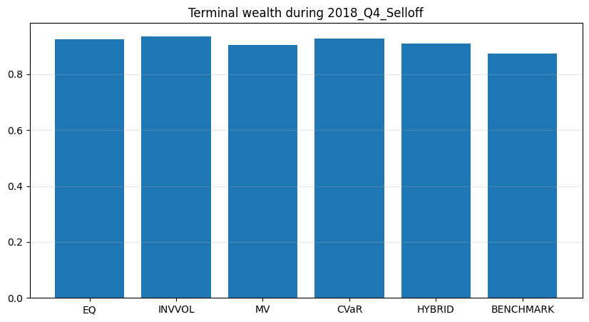
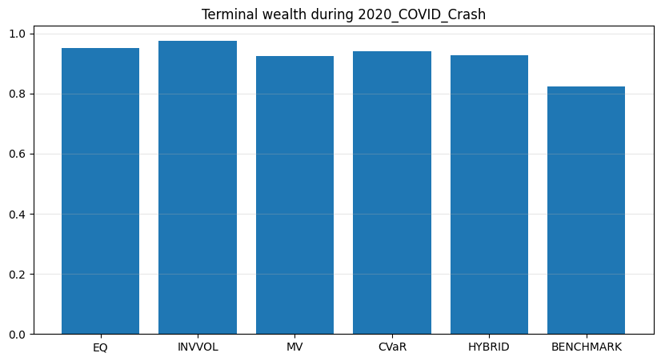
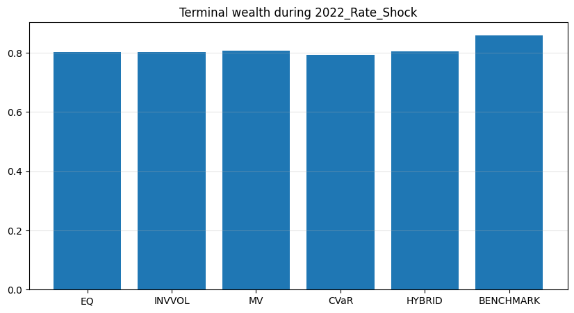
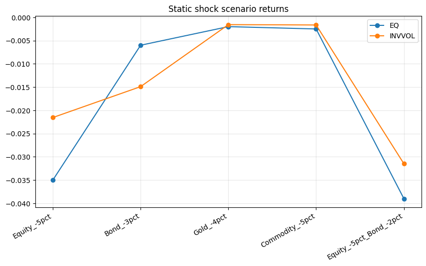

```python
%run 00setup.ipynb
```

    ✅ Setup complete
    


```python
TRADING_DAYS = 252
ALPHA_CVAR = 0.05
TRADING_DAYS = 252
ALPHA_CVAR = 0.05
```


```python
def annualized_return(ret: pd.Series, periods_per_year: int = TRADING_DAYS) -> float:
    ret = ret.dropna()
    if len(ret) == 0:
        return np.nan
    wealth = (1 + ret).prod()
    n_years = len(ret) / periods_per_year
    if n_years <= 0:
        return np.nan
    return wealth ** (1 / n_years) - 1

def annualized_vol(ret: pd.Series, periods_per_year: int = TRADING_DAYS) -> float:
    ret = ret.dropna()
    if len(ret) < 2:
        return np.nan
    return ret.std(ddof=1) * np.sqrt(periods_per_year)

def sharpe_ratio(ret: pd.Series, rf: float = 0.0, periods_per_year: int = TRADING_DAYS) -> float:
    ret = ret.dropna()
    if len(ret) < 2:
        return np.nan
    ann_ret = annualized_return(ret, periods_per_year)
    ann_vol = annualized_vol(ret, periods_per_year)
    if ann_vol == 0 or np.isnan(ann_vol):
        return np.nan
    return (ann_ret - rf) / ann_vol

def max_drawdown(ret: pd.Series) -> float:
    ret = ret.dropna()
    if len(ret) == 0:
        return np.nan
    wealth = (1 + ret).cumprod()
    peak = wealth.cummax()
    dd = wealth / peak - 1
    return dd.min()

def cvar_from_returns(ret: pd.Series, alpha: float = ALPHA_CVAR) -> float:
    ret = ret.dropna()
    if len(ret) == 0:
        return np.nan
    q = ret.quantile(alpha)
    tail = ret[ret <= q]
    if len(tail) == 0:
        return q
    return tail.mean()

def perf_summary(ret: pd.Series, name: str = None) -> pd.Series:
    out = pd.Series({
        "CAGR": annualized_return(ret),
        "AnnVol": annualized_vol(ret),
        "Sharpe": sharpe_ratio(ret),
        "MaxDD": max_drawdown(ret),
        "CVaR_5pct": cvar_from_returns(ret),
        "TerminalWealth": (1 + ret.dropna()).prod()
    })
    if name is not None:
        out.name = name
    return out
```


```python
# Load actual backtest outputs using your project style
prices = load_df("prices_clean", DATA_DIR, fmt="parquet")
prices["date"] = pd.to_datetime(prices["date"])
prices = prices.sort_values(["ticker", "date"]).reset_index(drop=True)

px_col = "adj_close"
prices["ret_1d"] = prices.groupby("ticker")[px_col].pct_change()

R = prices.pivot(index="date", columns="ticker", values="ret_1d").sort_index()
R = R.replace([np.inf, -np.inf], np.nan).dropna(how="all")

res_eq   = load_df("bt_eq_topk", DATA_DIR, fmt="parquet")
res_vp   = load_df("bt_invvol_topk", DATA_DIR, fmt="parquet")
res_mv   = load_df("bt_mv_topk", DATA_DIR, fmt="parquet")
res_cvar = load_df("bt_cvar_topk", DATA_DIR, fmt="parquet")
res_hyb  = load_df("bt_hybrid_topk", DATA_DIR, fmt="parquet")

for df in [res_eq, res_vp, res_mv, res_cvar, res_hyb]:
    df["date"] = pd.to_datetime(df["date"])
    df.set_index("date", inplace=True)
    df.sort_index(inplace=True)
```


```python
# Rebuild benchmark same way as in monte carlo notebook
bench_eq_univ = R.mean(axis=1).fillna(0.0)

def vol_target(net_ret, target_vol=0.12, lookback=63):
    vol = net_ret.rolling(lookback).std() * np.sqrt(252)
    scale = (target_vol / vol).replace([np.inf, -np.inf], np.nan).clip(0, 3.0)
    scale = scale.shift(1).fillna(0.0)
    return net_ret * scale, scale

bench_eq_univ_vt, _ = vol_target(bench_eq_univ, target_vol=0.12, lookback=63)

strat_ret = pd.DataFrame({
    "EQ": res_eq["vt"],
    "INVVOL": res_vp["vt"],
    "MV": res_mv["vt"],
    "CVaR": res_cvar["vt"],
    "HYBRID": res_hyb["vt"],
    "BENCHMARK": bench_eq_univ_vt
}).sort_index()

STRATEGY_COLS = ["EQ", "INVVOL", "MV", "CVaR", "HYBRID"]
BENCH_COL = "BENCHMARK"
plot_cols = STRATEGY_COLS + [BENCH_COL]
```


```python
# Align from true live start
live_mask = strat_ret[STRATEGY_COLS].abs().sum(axis=1) > 1e-12
common_start = strat_ret.index[live_mask][0]

strat_ret = strat_ret.loc[common_start:, plot_cols].dropna().copy()

print("Stress test sample:", strat_ret.index.min().date(), "->", strat_ret.index.max().date())
display(strat_ret.head())
```

    Stress test sample: 2016-06-02 -> 2025-12-30
    


<div>
<style scoped>
    .dataframe tbody tr th:only-of-type {
        vertical-align: middle;
    }

    .dataframe tbody tr th {
        vertical-align: top;
    }

    .dataframe thead th {
        text-align: right;
    }
</style>
<table border="1" class="dataframe">
  <thead>
    <tr style="text-align: right;">
      <th></th>
      <th>EQ</th>
      <th>INVVOL</th>
      <th>MV</th>
      <th>CVaR</th>
      <th>HYBRID</th>
      <th>BENCHMARK</th>
    </tr>
    <tr>
      <th>date</th>
      <th></th>
      <th></th>
      <th></th>
      <th></th>
      <th></th>
      <th></th>
    </tr>
  </thead>
  <tbody>
    <tr>
      <th>2016-06-02</th>
      <td>0.015767</td>
      <td>0.014106</td>
      <td>0.015001</td>
      <td>0.012391</td>
      <td>0.014479</td>
      <td>0.003904</td>
    </tr>
    <tr>
      <th>2016-06-03</th>
      <td>0.002510</td>
      <td>-0.000466</td>
      <td>-0.003163</td>
      <td>-0.010037</td>
      <td>-0.004538</td>
      <td>0.008526</td>
    </tr>
    <tr>
      <th>2016-06-06</th>
      <td>0.023497</td>
      <td>0.021973</td>
      <td>0.022542</td>
      <td>0.020110</td>
      <td>0.022056</td>
      <td>0.003846</td>
    </tr>
    <tr>
      <th>2016-06-07</th>
      <td>0.007902</td>
      <td>0.005932</td>
      <td>0.005394</td>
      <td>0.001583</td>
      <td>0.004632</td>
      <td>0.004473</td>
    </tr>
    <tr>
      <th>2016-06-08</th>
      <td>0.015114</td>
      <td>0.013899</td>
      <td>0.014372</td>
      <td>0.012439</td>
      <td>0.013985</td>
      <td>0.008370</td>
    </tr>
  </tbody>
</table>
</div>


```python
# 1) Historical stress periods
# Keep it simple and intuitive

stress_periods = {
    "2018_Q4_Selloff": ("2018-10-01", "2018-12-31"),
    "2020_COVID_Crash": ("2020-02-15", "2020-04-30"),
    "2022_Rate_Shock": ("2022-01-01", "2022-12-31"),
}
```


```python
hist_stress_rows = []

for label, (start, end) in stress_periods.items():
    sub = strat_ret.loc[start:end].copy()
    if len(sub) == 0:
        continue

    for c in plot_cols:
        s = perf_summary(sub[c], name=c).to_dict()
        s["StressPeriod"] = label
        s["Start"] = pd.to_datetime(start)
        s["End"] = pd.to_datetime(end)
        s["Portfolio"] = c
        hist_stress_rows.append(s)

hist_stress_df = pd.DataFrame(hist_stress_rows)
display(hist_stress_df.head())

save_df(hist_stress_df, "stress_test_historical_periods", DATA_DIR, fmt="parquet")
```


<div>
<style scoped>
    .dataframe tbody tr th:only-of-type {
        vertical-align: middle;
    }

    .dataframe tbody tr th {
        vertical-align: top;
    }

    .dataframe thead th {
        text-align: right;
    }
</style>
<table border="1" class="dataframe">
  <thead>
    <tr style="text-align: right;">
      <th></th>
      <th>CAGR</th>
      <th>AnnVol</th>
      <th>Sharpe</th>
      <th>MaxDD</th>
      <th>CVaR_5pct</th>
      <th>TerminalWealth</th>
      <th>StressPeriod</th>
      <th>Start</th>
      <th>End</th>
      <th>Portfolio</th>
    </tr>
  </thead>
  <tbody>
    <tr>
      <th>0</th>
      <td>-0.268287</td>
      <td>0.109137</td>
      <td>-2.458270</td>
      <td>-0.088195</td>
      <td>-0.017386</td>
      <td>0.924880</td>
      <td>2018_Q4_Selloff</td>
      <td>2018-10-01</td>
      <td>2018-12-31</td>
      <td>EQ</td>
    </tr>
    <tr>
      <th>1</th>
      <td>-0.233630</td>
      <td>0.108805</td>
      <td>-2.147227</td>
      <td>-0.078956</td>
      <td>-0.018192</td>
      <td>0.935642</td>
      <td>2018_Q4_Selloff</td>
      <td>2018-10-01</td>
      <td>2018-12-31</td>
      <td>INVVOL</td>
    </tr>
    <tr>
      <th>2</th>
      <td>-0.328781</td>
      <td>0.114569</td>
      <td>-2.869720</td>
      <td>-0.109523</td>
      <td>-0.017569</td>
      <td>0.905141</td>
      <td>2018_Q4_Selloff</td>
      <td>2018-10-01</td>
      <td>2018-12-31</td>
      <td>MV</td>
    </tr>
    <tr>
      <th>3</th>
      <td>-0.263327</td>
      <td>0.110185</td>
      <td>-2.389858</td>
      <td>-0.087656</td>
      <td>-0.016757</td>
      <td>0.926443</td>
      <td>2018_Q4_Selloff</td>
      <td>2018-10-01</td>
      <td>2018-12-31</td>
      <td>CVaR</td>
    </tr>
    <tr>
      <th>4</th>
      <td>-0.315894</td>
      <td>0.113403</td>
      <td>-2.785589</td>
      <td>-0.105159</td>
      <td>-0.017248</td>
      <td>0.909454</td>
      <td>2018_Q4_Selloff</td>
      <td>2018-10-01</td>
      <td>2018-12-31</td>
      <td>HYBRID</td>
    </tr>
  </tbody>
</table>
</div>


```python
hist_stress_pivot = hist_stress_df.pivot_table(
    index=["StressPeriod", "Portfolio"],
    values=["CAGR", "AnnVol", "Sharpe", "MaxDD", "CVaR_5pct", "TerminalWealth"],
    aggfunc="first"
).reset_index()

display(hist_stress_pivot.round(4))
```


<div>
<style scoped>
    .dataframe tbody tr th:only-of-type {
        vertical-align: middle;
    }

    .dataframe tbody tr th {
        vertical-align: top;
    }

    .dataframe thead th {
        text-align: right;
    }
</style>
<table border="1" class="dataframe">
  <thead>
    <tr style="text-align: right;">
      <th></th>
      <th>StressPeriod</th>
      <th>Portfolio</th>
      <th>AnnVol</th>
      <th>CAGR</th>
      <th>CVaR_5pct</th>
      <th>MaxDD</th>
      <th>Sharpe</th>
      <th>TerminalWealth</th>
    </tr>
  </thead>
  <tbody>
    <tr>
      <th>0</th>
      <td>2018_Q4_Selloff</td>
      <td>BENCHMARK</td>
      <td>0.1836</td>
      <td>-0.4157</td>
      <td>-0.0260</td>
      <td>-0.1564</td>
      <td>-2.2635</td>
      <td>0.8743</td>
    </tr>
    <tr>
      <th>1</th>
      <td>2018_Q4_Selloff</td>
      <td>CVaR</td>
      <td>0.1102</td>
      <td>-0.2633</td>
      <td>-0.0168</td>
      <td>-0.0877</td>
      <td>-2.3899</td>
      <td>0.9264</td>
    </tr>
    <tr>
      <th>2</th>
      <td>2018_Q4_Selloff</td>
      <td>EQ</td>
      <td>0.1091</td>
      <td>-0.2683</td>
      <td>-0.0174</td>
      <td>-0.0882</td>
      <td>-2.4583</td>
      <td>0.9249</td>
    </tr>
    <tr>
      <th>3</th>
      <td>2018_Q4_Selloff</td>
      <td>HYBRID</td>
      <td>0.1134</td>
      <td>-0.3159</td>
      <td>-0.0172</td>
      <td>-0.1052</td>
      <td>-2.7856</td>
      <td>0.9095</td>
    </tr>
    <tr>
      <th>4</th>
      <td>2018_Q4_Selloff</td>
      <td>INVVOL</td>
      <td>0.1088</td>
      <td>-0.2336</td>
      <td>-0.0182</td>
      <td>-0.0790</td>
      <td>-2.1472</td>
      <td>0.9356</td>
    </tr>
    <tr>
      <th>5</th>
      <td>2018_Q4_Selloff</td>
      <td>MV</td>
      <td>0.1146</td>
      <td>-0.3288</td>
      <td>-0.0176</td>
      <td>-0.1095</td>
      <td>-2.8697</td>
      <td>0.9051</td>
    </tr>
    <tr>
      <th>6</th>
      <td>2020_COVID_Crash</td>
      <td>BENCHMARK</td>
      <td>0.2865</td>
      <td>-0.6085</td>
      <td>-0.0473</td>
      <td>-0.2267</td>
      <td>-2.1239</td>
      <td>0.8240</td>
    </tr>
    <tr>
      <th>7</th>
      <td>2020_COVID_Crash</td>
      <td>CVaR</td>
      <td>0.2166</td>
      <td>-0.2561</td>
      <td>-0.0323</td>
      <td>-0.1301</td>
      <td>-1.1824</td>
      <td>0.9408</td>
    </tr>
    <tr>
      <th>8</th>
      <td>2020_COVID_Crash</td>
      <td>EQ</td>
      <td>0.2190</td>
      <td>-0.2112</td>
      <td>-0.0306</td>
      <td>-0.1201</td>
      <td>-0.9646</td>
      <td>0.9522</td>
    </tr>
    <tr>
      <th>9</th>
      <td>2020_COVID_Crash</td>
      <td>HYBRID</td>
      <td>0.2120</td>
      <td>-0.3026</td>
      <td>-0.0313</td>
      <td>-0.1377</td>
      <td>-1.4277</td>
      <td>0.9283</td>
    </tr>
    <tr>
      <th>10</th>
      <td>2020_COVID_Crash</td>
      <td>INVVOL</td>
      <td>0.2077</td>
      <td>-0.1110</td>
      <td>-0.0300</td>
      <td>-0.1033</td>
      <td>-0.5343</td>
      <td>0.9760</td>
    </tr>
    <tr>
      <th>11</th>
      <td>2020_COVID_Crash</td>
      <td>MV</td>
      <td>0.2113</td>
      <td>-0.3131</td>
      <td>-0.0313</td>
      <td>-0.1393</td>
      <td>-1.4818</td>
      <td>0.9254</td>
    </tr>
    <tr>
      <th>12</th>
      <td>2022_Rate_Shock</td>
      <td>BENCHMARK</td>
      <td>0.1315</td>
      <td>-0.1409</td>
      <td>-0.0181</td>
      <td>-0.1897</td>
      <td>-1.0717</td>
      <td>0.8596</td>
    </tr>
    <tr>
      <th>13</th>
      <td>2022_Rate_Shock</td>
      <td>CVaR</td>
      <td>0.1262</td>
      <td>-0.2081</td>
      <td>-0.0186</td>
      <td>-0.2190</td>
      <td>-1.6488</td>
      <td>0.7926</td>
    </tr>
    <tr>
      <th>14</th>
      <td>2022_Rate_Shock</td>
      <td>EQ</td>
      <td>0.1267</td>
      <td>-0.1992</td>
      <td>-0.0185</td>
      <td>-0.2136</td>
      <td>-1.5722</td>
      <td>0.8015</td>
    </tr>
    <tr>
      <th>15</th>
      <td>2022_Rate_Shock</td>
      <td>HYBRID</td>
      <td>0.1263</td>
      <td>-0.1956</td>
      <td>-0.0184</td>
      <td>-0.2101</td>
      <td>-1.5489</td>
      <td>0.8051</td>
    </tr>
    <tr>
      <th>16</th>
      <td>2022_Rate_Shock</td>
      <td>INVVOL</td>
      <td>0.1264</td>
      <td>-0.1977</td>
      <td>-0.0186</td>
      <td>-0.2130</td>
      <td>-1.5640</td>
      <td>0.8030</td>
    </tr>
    <tr>
      <th>17</th>
      <td>2022_Rate_Shock</td>
      <td>MV</td>
      <td>0.1262</td>
      <td>-0.1926</td>
      <td>-0.0184</td>
      <td>-0.2082</td>
      <td>-1.5252</td>
      <td>0.8081</td>
    </tr>
  </tbody>
</table>
</div>


```python
# One clean plot: terminal wealth by stress period

for label in hist_stress_df["StressPeriod"].unique():
    sub = hist_stress_df[hist_stress_df["StressPeriod"] == label].copy()

    plt.figure(figsize=(10, 5))
    plt.bar(sub["Portfolio"], sub["TerminalWealth"])
    plt.title(f"Terminal wealth during {label}")
    plt.grid(True, axis="y", alpha=0.3)
    plt.show()
```


    

    


    

    


    

    


```python
# 2) Simple one-day shock scenarios on asset returns
# Keep this static and simple. No re-optimization.

common_idx = strat_ret.index.intersection(R.index)
R_sub = R.loc[common_idx].dropna(how="any").copy()

assets = R_sub.columns.tolist()
N = len(assets)

w_eq = np.ones(N) / N

cov_hat = R_sub.cov().values * 252
eps = 1e-4
cov_hat_stable = cov_hat + eps * np.eye(cov_hat.shape[0])

invvol = 1 / np.sqrt(np.clip(np.diag(cov_hat_stable), 1e-12, None))
w_iv = invvol / invvol.sum()

ref_weights = {
    "EQ": pd.Series(w_eq, index=assets),
    "INVVOL": pd.Series(w_iv, index=assets),
}
```


```python
# Define simple shocks by asset group
# Edit tickers if needed, but this should fit your expanded ETF universe

equity_like = ["SPY", "QQQ", "DIA", "IWM", "FEZ", "EWU", "EWJ", "EEM", "USMV", "VNQ", "VTV", "VUG", "XLP", "XLU"]
bond_like   = ["TLT", "IEF", "LQD", "SHY"]
gold_like   = ["GLD"]
commodity_like = ["DBC"]

shock_scenarios = {
    "Equity_-5pct": {t: -0.05 for t in equity_like},
    "Bond_-3pct": {t: -0.03 for t in bond_like},
    "Gold_-4pct": {t: -0.04 for t in gold_like},
    "Commodity_-5pct": {t: -0.05 for t in commodity_like},
    "Equity_-5pct_Bond_-2pct": {**{t: -0.05 for t in equity_like}, **{t: -0.02 for t in bond_like}},
}
```


```python
shock_rows = []

for scen_name, shock_map in shock_scenarios.items():
    shock_vec = pd.Series(0.0, index=assets)
    for k, v in shock_map.items():
        if k in shock_vec.index:
            shock_vec.loc[k] = v

    for pname, w in ref_weights.items():
        port_shock = float((w * shock_vec).sum())
        shock_rows.append({
            "Scenario": scen_name,
            "Portfolio": pname,
            "ShockReturn": port_shock
        })

shock_df = pd.DataFrame(shock_rows)
display(shock_df.round(4))

save_df(shock_df, "stress_test_shock_scenarios", DATA_DIR, fmt="parquet")
```


<div>
<style scoped>
    .dataframe tbody tr th:only-of-type {
        vertical-align: middle;
    }

    .dataframe tbody tr th {
        vertical-align: top;
    }

    .dataframe thead th {
        text-align: right;
    }
</style>
<table border="1" class="dataframe">
  <thead>
    <tr style="text-align: right;">
      <th></th>
      <th>Scenario</th>
      <th>Portfolio</th>
      <th>ShockReturn</th>
    </tr>
  </thead>
  <tbody>
    <tr>
      <th>0</th>
      <td>Equity_-5pct</td>
      <td>EQ</td>
      <td>-0.0350</td>
    </tr>
    <tr>
      <th>1</th>
      <td>Equity_-5pct</td>
      <td>INVVOL</td>
      <td>-0.0216</td>
    </tr>
    <tr>
      <th>2</th>
      <td>Bond_-3pct</td>
      <td>EQ</td>
      <td>-0.0060</td>
    </tr>
    <tr>
      <th>3</th>
      <td>Bond_-3pct</td>
      <td>INVVOL</td>
      <td>-0.0149</td>
    </tr>
    <tr>
      <th>4</th>
      <td>Gold_-4pct</td>
      <td>EQ</td>
      <td>-0.0020</td>
    </tr>
    <tr>
      <th>5</th>
      <td>Gold_-4pct</td>
      <td>INVVOL</td>
      <td>-0.0016</td>
    </tr>
    <tr>
      <th>6</th>
      <td>Commodity_-5pct</td>
      <td>EQ</td>
      <td>-0.0025</td>
    </tr>
    <tr>
      <th>7</th>
      <td>Commodity_-5pct</td>
      <td>INVVOL</td>
      <td>-0.0016</td>
    </tr>
    <tr>
      <th>8</th>
      <td>Equity_-5pct_Bond_-2pct</td>
      <td>EQ</td>
      <td>-0.0390</td>
    </tr>
    <tr>
      <th>9</th>
      <td>Equity_-5pct_Bond_-2pct</td>
      <td>INVVOL</td>
      <td>-0.0315</td>
    </tr>
  </tbody>
</table>
</div>


```python
plt.figure(figsize=(10, 5))
for pname in shock_df["Portfolio"].unique():
    sub = shock_df[shock_df["Portfolio"] == pname]
    plt.plot(sub["Scenario"], sub["ShockReturn"], marker="o", label=pname)

plt.xticks(rotation=30, ha="right")
plt.title("Static shock scenario returns")
plt.grid(True, alpha=0.3)
plt.legend()
plt.show()
```


    

    


```python
# Final compact tables for report
display(hist_stress_pivot.round(4))
display(shock_df.round(4))
```


<div>
<style scoped>
    .dataframe tbody tr th:only-of-type {
        vertical-align: middle;
    }

    .dataframe tbody tr th {
        vertical-align: top;
    }

    .dataframe thead th {
        text-align: right;
    }
</style>
<table border="1" class="dataframe">
  <thead>
    <tr style="text-align: right;">
      <th></th>
      <th>StressPeriod</th>
      <th>Portfolio</th>
      <th>AnnVol</th>
      <th>CAGR</th>
      <th>CVaR_5pct</th>
      <th>MaxDD</th>
      <th>Sharpe</th>
      <th>TerminalWealth</th>
    </tr>
  </thead>
  <tbody>
    <tr>
      <th>0</th>
      <td>2018_Q4_Selloff</td>
      <td>BENCHMARK</td>
      <td>0.1836</td>
      <td>-0.4157</td>
      <td>-0.0260</td>
      <td>-0.1564</td>
      <td>-2.2635</td>
      <td>0.8743</td>
    </tr>
    <tr>
      <th>1</th>
      <td>2018_Q4_Selloff</td>
      <td>CVaR</td>
      <td>0.1102</td>
      <td>-0.2633</td>
      <td>-0.0168</td>
      <td>-0.0877</td>
      <td>-2.3899</td>
      <td>0.9264</td>
    </tr>
    <tr>
      <th>2</th>
      <td>2018_Q4_Selloff</td>
      <td>EQ</td>
      <td>0.1091</td>
      <td>-0.2683</td>
      <td>-0.0174</td>
      <td>-0.0882</td>
      <td>-2.4583</td>
      <td>0.9249</td>
    </tr>
    <tr>
      <th>3</th>
      <td>2018_Q4_Selloff</td>
      <td>HYBRID</td>
      <td>0.1134</td>
      <td>-0.3159</td>
      <td>-0.0172</td>
      <td>-0.1052</td>
      <td>-2.7856</td>
      <td>0.9095</td>
    </tr>
    <tr>
      <th>4</th>
      <td>2018_Q4_Selloff</td>
      <td>INVVOL</td>
      <td>0.1088</td>
      <td>-0.2336</td>
      <td>-0.0182</td>
      <td>-0.0790</td>
      <td>-2.1472</td>
      <td>0.9356</td>
    </tr>
    <tr>
      <th>5</th>
      <td>2018_Q4_Selloff</td>
      <td>MV</td>
      <td>0.1146</td>
      <td>-0.3288</td>
      <td>-0.0176</td>
      <td>-0.1095</td>
      <td>-2.8697</td>
      <td>0.9051</td>
    </tr>
    <tr>
      <th>6</th>
      <td>2020_COVID_Crash</td>
      <td>BENCHMARK</td>
      <td>0.2865</td>
      <td>-0.6085</td>
      <td>-0.0473</td>
      <td>-0.2267</td>
      <td>-2.1239</td>
      <td>0.8240</td>
    </tr>
    <tr>
      <th>7</th>
      <td>2020_COVID_Crash</td>
      <td>CVaR</td>
      <td>0.2166</td>
      <td>-0.2561</td>
      <td>-0.0323</td>
      <td>-0.1301</td>
      <td>-1.1824</td>
      <td>0.9408</td>
    </tr>
    <tr>
      <th>8</th>
      <td>2020_COVID_Crash</td>
      <td>EQ</td>
      <td>0.2190</td>
      <td>-0.2112</td>
      <td>-0.0306</td>
      <td>-0.1201</td>
      <td>-0.9646</td>
      <td>0.9522</td>
    </tr>
    <tr>
      <th>9</th>
      <td>2020_COVID_Crash</td>
      <td>HYBRID</td>
      <td>0.2120</td>
      <td>-0.3026</td>
      <td>-0.0313</td>
      <td>-0.1377</td>
      <td>-1.4277</td>
      <td>0.9283</td>
    </tr>
    <tr>
      <th>10</th>
      <td>2020_COVID_Crash</td>
      <td>INVVOL</td>
      <td>0.2077</td>
      <td>-0.1110</td>
      <td>-0.0300</td>
      <td>-0.1033</td>
      <td>-0.5343</td>
      <td>0.9760</td>
    </tr>
    <tr>
      <th>11</th>
      <td>2020_COVID_Crash</td>
      <td>MV</td>
      <td>0.2113</td>
      <td>-0.3131</td>
      <td>-0.0313</td>
      <td>-0.1393</td>
      <td>-1.4818</td>
      <td>0.9254</td>
    </tr>
    <tr>
      <th>12</th>
      <td>2022_Rate_Shock</td>
      <td>BENCHMARK</td>
      <td>0.1315</td>
      <td>-0.1409</td>
      <td>-0.0181</td>
      <td>-0.1897</td>
      <td>-1.0717</td>
      <td>0.8596</td>
    </tr>
    <tr>
      <th>13</th>
      <td>2022_Rate_Shock</td>
      <td>CVaR</td>
      <td>0.1262</td>
      <td>-0.2081</td>
      <td>-0.0186</td>
      <td>-0.2190</td>
      <td>-1.6488</td>
      <td>0.7926</td>
    </tr>
    <tr>
      <th>14</th>
      <td>2022_Rate_Shock</td>
      <td>EQ</td>
      <td>0.1267</td>
      <td>-0.1992</td>
      <td>-0.0185</td>
      <td>-0.2136</td>
      <td>-1.5722</td>
      <td>0.8015</td>
    </tr>
    <tr>
      <th>15</th>
      <td>2022_Rate_Shock</td>
      <td>HYBRID</td>
      <td>0.1263</td>
      <td>-0.1956</td>
      <td>-0.0184</td>
      <td>-0.2101</td>
      <td>-1.5489</td>
      <td>0.8051</td>
    </tr>
    <tr>
      <th>16</th>
      <td>2022_Rate_Shock</td>
      <td>INVVOL</td>
      <td>0.1264</td>
      <td>-0.1977</td>
      <td>-0.0186</td>
      <td>-0.2130</td>
      <td>-1.5640</td>
      <td>0.8030</td>
    </tr>
    <tr>
      <th>17</th>
      <td>2022_Rate_Shock</td>
      <td>MV</td>
      <td>0.1262</td>
      <td>-0.1926</td>
      <td>-0.0184</td>
      <td>-0.2082</td>
      <td>-1.5252</td>
      <td>0.8081</td>
    </tr>
  </tbody>
</table>
</div>


<div>
<style scoped>
    .dataframe tbody tr th:only-of-type {
        vertical-align: middle;
    }

    .dataframe tbody tr th {
        vertical-align: top;
    }

    .dataframe thead th {
        text-align: right;
    }
</style>
<table border="1" class="dataframe">
  <thead>
    <tr style="text-align: right;">
      <th></th>
      <th>Scenario</th>
      <th>Portfolio</th>
      <th>ShockReturn</th>
    </tr>
  </thead>
  <tbody>
    <tr>
      <th>0</th>
      <td>Equity_-5pct</td>
      <td>EQ</td>
      <td>-0.0350</td>
    </tr>
    <tr>
      <th>1</th>
      <td>Equity_-5pct</td>
      <td>INVVOL</td>
      <td>-0.0216</td>
    </tr>
    <tr>
      <th>2</th>
      <td>Bond_-3pct</td>
      <td>EQ</td>
      <td>-0.0060</td>
    </tr>
    <tr>
      <th>3</th>
      <td>Bond_-3pct</td>
      <td>INVVOL</td>
      <td>-0.0149</td>
    </tr>
    <tr>
      <th>4</th>
      <td>Gold_-4pct</td>
      <td>EQ</td>
      <td>-0.0020</td>
    </tr>
    <tr>
      <th>5</th>
      <td>Gold_-4pct</td>
      <td>INVVOL</td>
      <td>-0.0016</td>
    </tr>
    <tr>
      <th>6</th>
      <td>Commodity_-5pct</td>
      <td>EQ</td>
      <td>-0.0025</td>
    </tr>
    <tr>
      <th>7</th>
      <td>Commodity_-5pct</td>
      <td>INVVOL</td>
      <td>-0.0016</td>
    </tr>
    <tr>
      <th>8</th>
      <td>Equity_-5pct_Bond_-2pct</td>
      <td>EQ</td>
      <td>-0.0390</td>
    </tr>
    <tr>
      <th>9</th>
      <td>Equity_-5pct_Bond_-2pct</td>
      <td>INVVOL</td>
      <td>-0.0315</td>
    </tr>
  </tbody>
</table>
</div>

